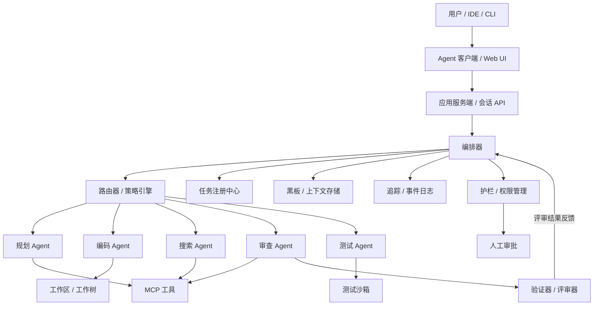

# 生产级多 Agent 运行时

此架构适用于内部编码 Agent 平台、Agent CLI、IDE Agent 后端，或 Claude Code / Codex 风格系统的编排层。



## 核心模块

| 模块 | 职责 | 需要交付的能力 |
|---|---|---|
| 应用服务端 / 会话 API | 接收来自用户、IDE、CLI 的请求 | 会话管理、流式传输、取消、恢复 |
| 编排器 | 调度 Agent 和工作流 | 规划、路由、重试、超时、检查点 |
| Agent 注册中心 | 管理 Agent 定义 | 名称、角色、模型、工具、权限、提示词 |
| 任务注册中心 | 管理任务树 | 任务 ID、父任务 ID、状态、负责人、产出物 |
| 黑板 / 上下文存储 | 持有共享事实和产出物 | 事实、产出物、决策、TTL、来源追踪 |
| 事件日志 / 追踪 | 记录每个动作 | 消息、工具调用、交接、状态变更 |
| 护栏 | 权限与安全 | 策略、风险评分、审批、沙箱 |
| 工作区管理器 | 隔离执行环境 | 工作树、容器、快照、回滚 |
| 协议网关 | 对外暴露给其他系统 | MCP、A2A、Agent 客户端协议 |

## 推荐数据模型

```ts
export type Permission = {
  level: "L0" | "L1" | "L2" | "L3" | "L4" | "L5";
  scope: string;           // 如 "file:read"、"shell:write"、"network:external"
  description?: string;
};

export type Artifact = {
  id: string;
  name: string;
  type: "file" | "code" | "document" | "data";
  uri: string;
  checksum?: string;
  createdAt: string;
};

export type Session = {
  id: string;
  userId: string;
  config?: Record<string, unknown>;
  budget?: { tokensLimit: number; timeLimitMs: number };
};

export type AgentDefinition = {
  id: string;
  name: string;
  role: string;
  model: string;
  instructions: string;
  tools: string[];
  permissions: Permission[];
  memoryScope: "none" | "session" | "project" | "global";
};

export type Task = {
  id: string;
  parentId?: string;
  sessionId: string;
  assignedAgent?: string;
  goal: string;
  status: "pending" | "running" | "blocked" | "done" | "failed" | "cancelled";
  input: unknown;
  output?: unknown;
  artifacts?: Artifact[];
  createdAt: string;
  updatedAt: string;
};

/**
 * 完整事件模型定义见 observability.md 的 AgentEvent 类型。
 * 此处为最小化引用版本，仅包含编排器运行循环所需字段。
 */
export type TraceEvent = {
  id: string;
  runId: string;
  sessionId: string;
  taskId?: string;
  actor: string;
  type: string;
  payload: unknown;
  timestamp: string;
};
```

## 最小运行循环

```ts
async function runSession(session: Session) {
  let state = await loadCheckpoint(session.id);

  while (!state.done) {
    const next = await orchestrator.next(state);

    await eventBus.publish({
      type: "workflow.node.enter",
      actor: "orchestrator",
      payload: next,
    });

    const result = await runNode(next, state);
    state = await checkpoint(reduce(state, result));
  }

  return state.finalAnswer;
}
```

## 核心原则

1. **Agent 是可替换的执行单元，而非全局状态容器。**
2. **编排器掌控流程；Agent 负责专业产出。**
3. **黑板存储事实和产出物；追踪记录过程。**
4. **所有高风险操作必须经过护栏。**
5. **每个 Agent 的上下文应当最小化、隔离且可审计。**