# 多 Agent Wiki

一份关于**多 Agent 交互模式、分类与工程实现**的工作参考。不是论文综述，也不是框架宣传册——而是一个工程知识库，其中每种模式都回答四个问题：

1. 它解决什么问题？
2. 它的通信/控制结构是什么？
3. 如何在真实系统中实现它？
4. 什么时候*不应该*使用它？

## 推荐阅读路径

- 新来的 → 从[分类法](taxonomy)开始
- 选择设计方案 → 跳转到[决策矩阵](decision-matrix)
- 搭建平台 → 阅读[生产运行时架构](implementation/production-runtime)
- 添加新模式 → 使用[模式页面模板](implementation/pattern-page-template)
- 查阅术语 → 参考[术语表](reference/glossary)

## 一句话定义

一个**多 Agent 系统**由多个 Agent 组成——每个 Agent 拥有自己的职责、状态、工具或上下文——它们通过消息、工具调用、共享状态、事件流、协议或环境变化来进行协作、竞争、审查、委托和任务分解。

## 全局分类法

```mermaid
flowchart TD
  A["多 Agent Wiki"] --> B["控制结构"]
  A --> C["信息流"]
  A --> D["决策"]
  A --> E["执行环境"]
  A --> F["协议互联"]

  B --> B1["监督者 / 管理者"]
  B --> B2["代理即工具"]
  B --> B3["交接 / 路由"]
  B --> B4["层次化"]
  B --> B5["点对点 / 群集"]

  C --> C1["顺序管道"]
  C --> C2["并行扇出 / 汇聚"]
  C --> C3["群聊"]
  C --> C4["嵌套对话"]
  C --> C5["黑板 / 共享内存"]
  C --> C6["事件总线 / 发布-订阅"]

  D --> D1["辩论 / 裁决"]
  D --> D2["投票 / 集成"]
  D --> D3["生成器-评审者"]
  D --> D4["精炼循环"]
  D --> D5["市场 / 拍卖"]
  D --> D6["边缘澄清"]

  E --> E1["角色扮演 / SOP"]
  E --> E2["人在回路"]
  E --> E3["工作区 / 沙箱"]
  E --> E4["共识主动性"]
  E --> E5["模拟 / MARL"]

  F --> F1["MCP：Agent-工具"]
  F --> F2["A2A：Agent-Agent"]
  F --> F3["ACP / ANP"]
  F --> F4["Agent 客户端协议"]
```

## 为什么要分类？

多 Agent 不只是"让很多 LLM 互相聊天"。在生产环境中，真正重要的问题是：

- 任意时刻谁来掌握控制权？
- Agent 之间的上下文如何隔离？
- 相互冲突的输出如何合并？
- 任务如何恢复、取消、重试和追踪？
- 哪些操作需要人工审批？
- 哪些能力通过 MCP / A2A / Agent Client Protocol 对外暴露？

在公开资料中，OpenAI Agents SDK 将 Agent 定义为规划、调用工具、跨专家协作并维护状态的单元；LangChain 将多 Agent 拆分为子 Agent 、交接、技能和路由；Google ADK 则将管道、并行、层次化、生成器-评审者、精炼循环和人在回路视为可组合的生产模式。参见[参考资料](reference/references)。