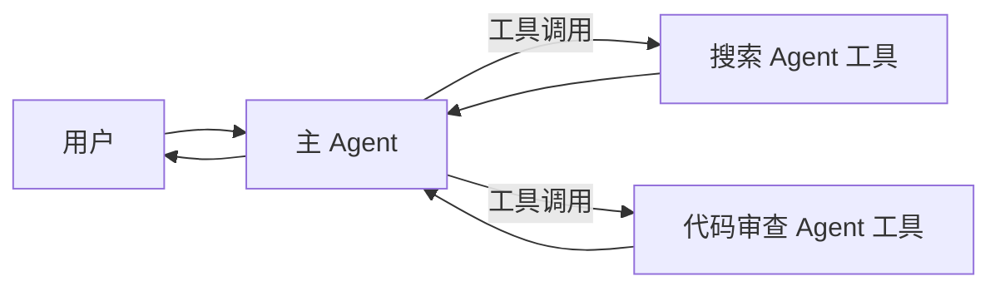

# Agent 即工具模式

## 定义

将专家 Agent 封装为可调用的工具。主 Agent 从不放弃控制权——它像调用普通函数一样调用专家 Agent。

**类别**：控制结构

## 结构



## 适用场景

一次性专家查询、检索子任务、代码审查、文档摘要、以工具形式暴露的内部能力。

## 不适用场景

当专家 Agent 需要与用户进行持续多轮对话，或 Agent 之间需要互相接管时。

## 实现方法

1. 将每个子 Agent 封装为普通工具，例如 `callSearchAgent(input)`。
2. 工具 schema 必须精确定义输入和输出——不要留自然语言接口。
3. 主 Agent 的系统提示中声明何时调用每个 Agent 工具。
4. 子 Agent 不直接面对用户；它们返回结果、证据和限制说明。
5. 每个 Agent 工具获得独立的追踪记录，便于定位失败原因。

## 最小化伪代码

```ts
const searchAgentTool = tool({
  name: "search_agent",
  description: "调查公开来源并返回证据列表",
  schema: z.object({ query: z.string(), depth: z.enum(["fast", "deep"]) }),
  execute: async ({ query, depth }) => searchAgent.run({ query, depth })
});

const mainAgent = new Agent({
  tools: [searchAgentTool, reviewAgentTool],
  instructions: "需要研究时调用 search_agent；需要质量检查时调用 review_agent。"
});
```

## 推荐追踪事件

- `tool.agent.invoked`
- `tool.agent.output`
- `tool.agent.error`

## 常见失败模式

- 子 Agent 工具的描述过于宽泛；主 Agent 不加区分地调用它。
- 子 Agent 返回冗长的自然语言而非结构化结果。
- 主 Agent 将子 Agent 视为权威来源而不进行验证。

## 实现检查清单

- [ ] 输入/输出 schema 已定义。
- [ ] 每个 Agent 的权限边界已定义。
- [ ] 每次 Agent 调用均携带 run id / trace id。
- [ ] 失败、超时、取消和重试策略已定义。
- [ ] 传递的上下文为最小必要内容，而非完整历史。
- [ ] 高风险操作需要审批或验证者把关。

## 参考资料

- [OpenAI 工具](https://openai.github.io/openai-agents-python/tools/)
- [LangChain 多 Agent](https://docs.langchain.com/oss/python/langchain/multi-agent)