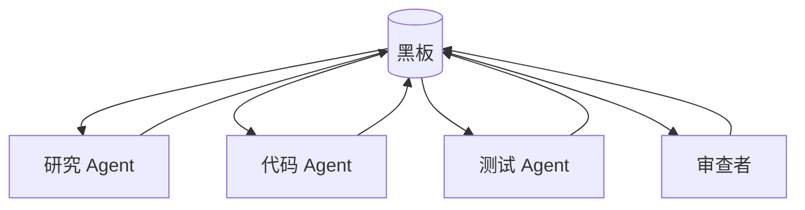

# 黑板 / 共享内存 / 工作区

## 定义

多个 Agent 通过共享状态、知识库、任务板或工作区间接协作。

**类别**：信息流

## 结构



## 适用场景

长时间运行的任务、异步协作、多方共享证据、代码工作区、任务状态管理。

## 不适用场景

当共享状态没有版本控制、没有权限、没有过期机制时——它会腐化。

## 实现方法

1. 分区黑板：`facts / hypotheses / tasks / artifacts / decisions`（事实 / 假设 / 任务 / 产出物 / 决策）。
2. 每条记录携带来源、时间戳、置信度、所有者、TTL。
3. Agent 仅通过 API 读写——不直接修改全局状态。
4. 将冲突事实展示为冲突集；不要静默覆盖。

## 最小化伪代码

```ts
type BlackboardItem = {
  id: string;
  type: "fact" | "hypothesis" | "artifact" | "decision" | "task";
  content: unknown;
  sourceAgent: string;
  confidence?: number;
  createdAt: string;
  ttl?: number;
};
```

## 推荐的追踪事件

- `blackboard.item.created`
- `blackboard.item.updated`
- `blackboard.conflict.detected`
- `blackboard.item.expired`

## 常见失败模式

- 状态污染。
- 过期条目被当作新鲜数据。
- 多个 Agent 并发写入。
- 缺乏数据溯源。

## 实现检查清单

- [ ] 已定义输入/输出 schema。
- [ ] 已定义每个 Agent 的权限边界。
- [ ] 每个 Agent 调用携带 run id / trace id。
- [ ] 已定义失败、超时、取消和重试策略。
- [ ] 传递的上下文为所需最小集，而非完整历史。
- [ ] 高风险操作由审批或验证器把关。

## 参考资料

- [Erman et al. (1980) — Hearsay-II 黑板架构奠基论文](https://doi.org/10.1145/356810.356816)
- [通信模式综述](https://arxiv.org/html/2502.14321v2)
- [Google ADK 模式](https://developers.googleblog.com/developers-guide-to-multi-agent-patterns-in-adk/)