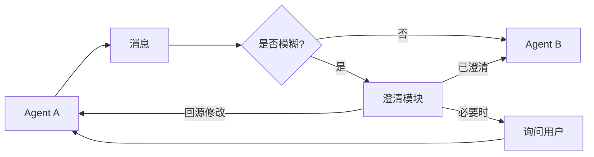

# 边缘澄清 / 行动前询问

## 定义

在 Agent 间交接边缘或不确定操作前插入澄清步骤，以减少错误传播。

**类别**：决策

## 适用场景

需求模糊、Agent 交接、长任务、多约束任务、用户意图不明确。

## 不适用场景

每一步都询问不可接受，或澄清无法改变执行结果时。

## 结构



## 实现方法

1. 对每条跨 Agent 消息进行模糊度/风险评分。
2. 超过阈值时，向源 Agent 或用户询问——不要猜测。
3. 澄清问题应少而精、具体且可操作。
4. 记录澄清是否实际减少了失败，并调整阈值。

## 最小化伪代码

```ts
let msg = edgeMessage;
const score = ambiguityScorer.score(msg);
if (score > threshold) {
  const clarification = await askClarification(msg);
  msg = merge(msg, clarification);
}
return targetAgent.run(msg);
```

## 推荐的追踪事件

- `clarification.triggered`
- `clarification.question.asked`
- `clarification.answer.received`
- `clarification.skipped`

## 常见失败模式

- 过度打断用户。
- 问题过于抽象，无法回答。
- 澄清结果未能回流到状态中。

## 实现检查清单

- [ ] 定义输入/输出 schema。
- [ ] 定义每个 Agent 的权限边界。
- [ ] 每个 Agent 调用携带 run id / trace id。
- [ ] 定义失败、超时、取消和重试策略。
- [ ] 传递的上下文为所需的最小量，而非完整历史。
- [ ] 高风险操作由审批或验证器把关。

## 参考资料

- [AgentAsk](https://arxiv.org/html/2510.07593v1)