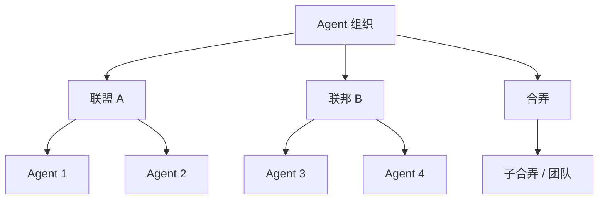

# 联盟 / 联邦 / 合弄制组织

## 定义

多个 agent 围绕任务临时形成联盟、团队、联邦或合弄。关注点是治理、成员资格和自治边界——而非单次调用流程。

**分类**：组织

## 结构



## 适用场景

跨团队协作、开放 agent 网络、多组织任务、互联的内部 agent 平台。

## 不适用场景

小型固定流程；无动态团队组建需求；简单的权限边界。

## 如何实现

1. 定义组织注册表：组织、成员、能力、信任级别。
2. 定义加入、退出、授权和撤销的规则。
3. 对于联盟任务，建立共享契约：目标、资源、收益、问责。
4. 联邦系统必须清晰分离本地自治与全局协调。

## 最小化伪代码

```ts
type Organization = {
  id: string;
  type: "coalition" | "federation" | "holon" | "team";
  members: AgentId[];
  policy: AccessPolicy;
  sharedGoal?: string;
};

function formCoalition(task, candidates) {
  return candidates.filter(a => matches(task.requiredSkills, a.skills));
}
```

## 推荐的追踪事件

- `organization.created`
- `organization.member.joined`
- `organization.member.left`
- `organization.policy.updated`

## 常见失败模式

- 成员权限不清晰。
- 联盟目标与个体目标冲突。
- 组织状态从未被清理。

## 实施清单

- [ ] 触发和退出条件已定义。
- [ ] 输入/输出 schema 已定义。
- [ ] 权限、预算、超时和重试策略已定义。
- [ ] 追踪事件已定义。
- [ ] 降级或人工接管策略已定义。

## 参考资料

- [多 agent 系统中的组织范式](https://dl.acm.org/doi/abs/10.1017/s0269888905000317)