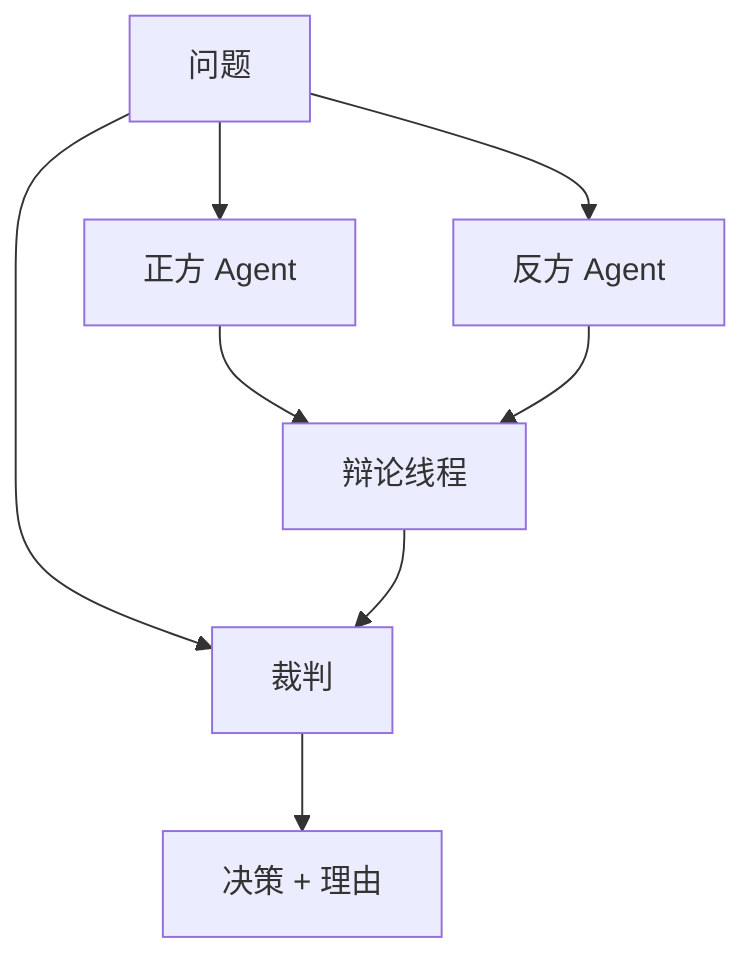

# 辩论 / 裁判

## 定义

多个 Agent 提出不同立场或答案并相互质疑；由裁判机制选出最终结果。对于独立候选答案的投票/集成模式，参见 [投票 / 集成](voting-ensemble)。

**类别**：决策

## 结构



## 适用场景

选项选择、红队/蓝队对抗、事实核查、复杂推理、在多个候选答案中进行选择。

## 不适用场景

答案可通过工具验证时、成本敏感时、或裁判本身不可靠时。

## 实现方法

1. 让 Agent 独立生成初始立场，减少交叉污染。
2. 限制辩论轮数，避免无休止的争论。
3. 裁判必须引用证据和评分标准——而非仅凭偏好。
4. 对于可验证的任务，优先使用工具验证而非 LLM 裁判。

## 最小化伪代码

```ts
async function debateAndJudge(agents, question, judge, rubric) {
  const results = await Promise.allSettled(agents.map(a => a.propose(question)));
  const proposals = results
    .filter(r => r.status === "fulfilled")
    .map(r => r.value);
  const debate = await runDebate(proposals, { rounds: 2 });
  return judge.evaluate({ question, proposals, debate, rubric });
}
```

## 推荐的追踪事件

- `debate.proposal.created`
- `debate.round.completed`
- `judge.verdict.created`
- `vote.tallied`

## 常见失败模式

- 有说服力但事实上错误的论点胜出。
- 裁判偏向更善辩的 Agent。
- 成本超过决策本身的价值。

## 实现检查清单

- [ ] 输入/输出 schema 已定义。
- [ ] 每个 Agent 的权限边界已定义。
- [ ] 每次 Agent 调用都携带 run id / trace id。
- [ ] 失败、超时、取消和重试策略已定义。
- [ ] 传递的上下文为最小必要信息，而非完整历史记录。
- [ ] 高风险操作由审批或验证器把关。

## 参考资料

- [Survey: LLM-based multi-agent](https://arxiv.org/html/2412.17481v2)
- [Du et al. — Improving Factuality and Reasoning in Language Models through Multiagent Debate (2023)](https://arxiv.org/abs/2305.14325)
- [Liang et al. — Encouraging Divergent Thinking in LLMs through Multi-Agent Debate (2023)](https://arxiv.org/abs/2305.19118)
- [Zheng et al. — Judging LLM-as-a-Judge with MT-Bench and Chatbot Arena (NeurIPS 2023)](https://arxiv.org/abs/2306.05685)