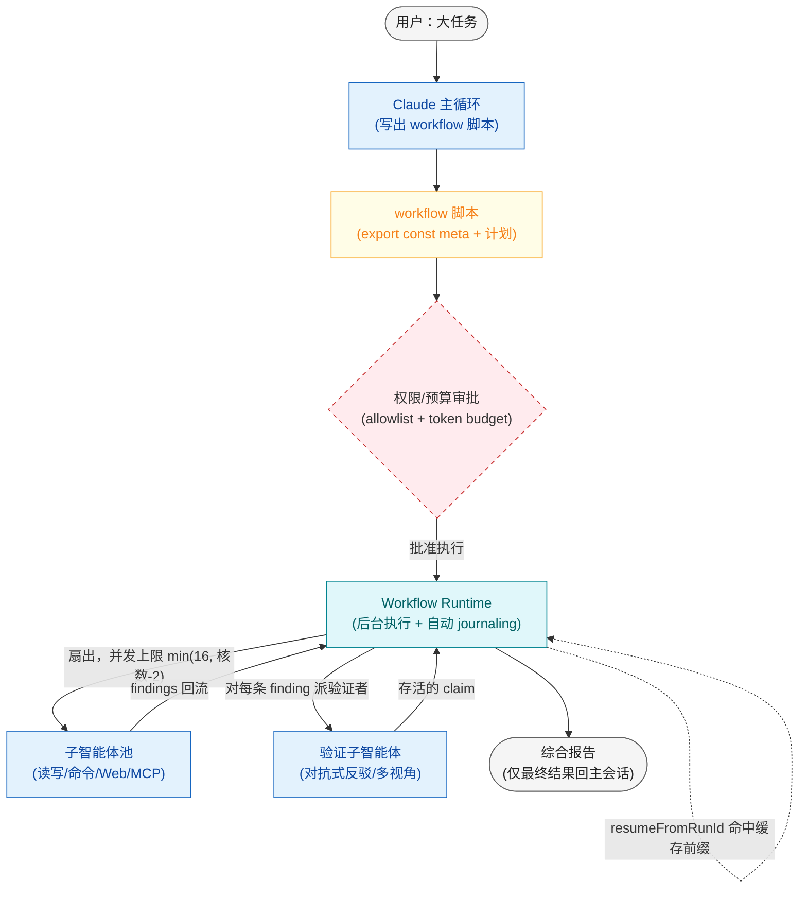

# 动态工作流 / 代码编排子智能体

## 定义

把编排逻辑从「每一轮对话的临场判断」固化成一段**可执行的 JavaScript 脚本**：脚本持有完整计划——阶段、循环、分支、扇出形状、收敛与停止条件、以及全部中间变量；真正的读文件、改文件、跑命令、抓 Web、调 MCP 由脚本扇出的**子智能体**完成。脚本本身没有文件系统或 shell 权限，任何有副作用的动作都必须经由子智能体。

这是 Claude Code 的 Workflow（Dynamic Workflows）工具所对应的模式。和「对话式编排子智能体」相比，关键区别在于：**计划是一等产物（脚本），而非主智能体每轮推理的副产物**。脚本由 runtime 在后台执行并自动 journaling，因此可中断恢复、可保存复跑、规模可达数百个 agent。

**类别**：工作流

> 研究预览阶段：下文使用的全局原语（`agent` / `parallel` / `pipeline` / `phase` / `log` / `budget` / `workflow`）签名可能继续演进，但语义已稳定。注意它们是**全局函数**，不是某个 `ctx.` 对象上的方法。

## 结构



拓扑要点：用户的大任务先由 Claude 主循环翻译成一段脚本；脚本连同阶段计划与成本估算过一道权限/预算审批；runtime 在后台执行并扇出子智能体池；worker 产出的 findings 不直接进报告，而是先经验证子智能体对抗式核验；只有存活的 claim 才进入综合，且**只有最终报告**回到主会话——几十个文件的中间结果从不挤占主上下文。

## 适用场景

- **全代码库审计**：安全扫描、依赖检查、API 表面审查跨数百个文件——单轮对话装不下全部中间结果。
- **大规模迁移**：逐文件做行为等价移植，每个文件配独立审查 agent，外加一个 build/test 修复循环。
- **交叉验证的研究**：从多个来源收集论断，对每条论断独立派验证者反驳，只综合「活下来的」证据。
- **方案压力测试**：生成多个候选方案，对每个跑对抗式审查或评委打分，收敛到最经得起推敲的那个。
- **可复用的工程流程**：你想把它保存进 `.claude/workflows/`（项目级）或 `~/.claude/workflows/`（用户级），换参数反复跑的工作流。

## 不适用场景

- **小任务**：单个 agent 一轮就能搞定的事，套脚本只会徒增 token 成本与复杂度。
- **高交互任务**：workflow 运行中**不接受中途人工输入**。若每步都要人签字，应拆成若干带审批门的小 workflow，而不是一个大 workflow。
- **无预算约束**：workflow 会成倍放大 token 消耗。先用一个限定范围的小任务试水，再决定要不要跑全库。
- **未治理的权限**：没审过工具 allowlist 和 shell 策略之前，别跑一个会扇出几十个带写权限 agent 的脚本——子智能体继承会话的 allowlist。

## 实现方法

把编排职责按四层语义拆清楚，每一层只管自己的事：

| 层 | 职责 |
|---|---|
| 工作流脚本 | 控制流：阶段切换、循环条件、扇出形状（`parallel` / `pipeline`）、停止与收敛条件、中间变量 |
| Runtime | 扇出 agent、收集结果、并发调度（上限 `min(16, 核数-2)`）、自动持久化与 resume |
| Worker 子智能体 | 读文件、写编辑、跑 shell、抓 Web、调 MCP——所有副作用都在这里发生 |
| Verifier 子智能体 | 在 finding 进入综合前尝试证伪，把弱论断挡在编排层而非交给最终综合 agent |

落地要点：

1. **脚本顶部必须是 `export const meta = {...}` 纯字面量块**（`name` / `description` 必填，`whenToUse` / `phases` / `model` 可选）。meta 里不能有变量、函数调用、展开或模板插值。`phases` 数组的每一项应对应脚本里的一次 `phase()` 调用、title 精确匹配；若某个命名阶段是通过 `agent()` 的 `opts.phase` 在 `pipeline` / `parallel` 内归组的（而非顶层 `phase()`），请在脚本注释里点明，以免与「每项对应一次 `phase()`」的措辞产生歧义。
2. **脚本是纯 JavaScript，不是 TypeScript**——不要写类型注解、interface、泛型。脚本体在 async 上下文里运行，直接 `await`。
3. **结构化输出优先**：给 `agent()` 传 `schema`（JSON Schema），子智能体会被强制走 StructuredOutput 工具，返回已校验对象（不匹配自动重试），省去手动解析自然语言。这对应「不要在步骤间传递原始自然语言」的流水线纪律。
4. **多阶段默认用 `pipeline` 而非 `parallel`**：`pipeline` 让每个 item 独立流过各 stage、阶段间无 barrier，墙钟 = 最慢的单条链；`parallel` 是 barrier（等全部完成），仅在你确实要把全部结果一起拿到（全局去重 / 排序 / 早退）时才用。
5. **质量是编排层的事**：worker 从独立切片产出 findings；对每条 finding 派验证者对抗式反驳（或给不同视角：correctness / security / repro）；存活的才进综合。脚本可对争议区域重跑或要求更窄的证据。
6. **恢复靠自动 journaling，没有手动 checkpoint**：每次调用都会持久化脚本并返回 `scriptPath` 与 `runId`；要恢复就用 `Workflow({ scriptPath, resumeFromRunId })`——脚本中**最长未改动前缀**的 `agent()` 调用直接返回缓存结果，第一个改动/新增的调用及其之后才真正重跑。这就是为什么脚本里**禁用 `Date.now()` / `Math.random()` / 无参 `new Date()`**：它们会破坏 resume 的确定性。需要时间戳就走 `args` 传入，需要随机性就按 index 变化。
7. **用 `budget` 做硬上限循环**：`budget.total` 是本轮 token 目标（用户用「+500k」式指令设定），是硬上限；可写 `while (budget.total && budget.remaining() > 50_000) { ... }` 让规模随预算自适应。
8. **不静默截断**：若做了 top-N、采样等裁剪，必须 `log()` 出被丢弃的部分，否则报告会假装完整。

## 最小化伪代码

```js
// 全代码库安全审计：发现 → 对抗式验证 → 综合。真实 Workflow API。
export const meta = {
  name: "security-audit",
  description: "跨文件扇出审计，每条 finding 经独立验证者证伪后才综合",
  whenToUse: "对一个目录做安全/正确性审查，且文件数超出单轮能力时",
  // 注：以下 4 个阶段名中，前 3 个对应顶层 phase() 调用（发现任务面/扇出审计/综合报告）；
  // "对抗式验证" 没有顶层 phase()，它是通过 pipeline 内 agent() 的 opts.phase 归组的命名阶段。
  phases: ["发现任务面", "扇出审计", "对抗式验证", "综合报告"],
};

// 阶段 1：先用一个 agent 把任务面（待审文件列表）摸出来；结构化返回避免解析自然语言
phase("发现任务面");
const survey = await agent(
  `列出 ${args.dir} 下需要安全审计的源文件，按风险从高到低排序`,
  { label: "map-codebase", schema: { type: "object", properties: { files: { type: "array", items: { type: "string" } } }, required: ["files"] } }
);

// 阶段 2 + 3：pipeline 让每个文件「审计完立刻验证」，阶段间无 barrier，墙钟=最慢单条链
phase("扇出审计");
const audited = await pipeline(
  survey.files,
  // stage1：审一个文件，结构化产出 findings
  (file) => agent(`审计文件 ${file}，列出每个安全问题`, {
    label: `audit:${file}`,
    schema: { type: "object", properties: { findings: { type: "array", items: { type: "object" } } }, required: ["findings"] },
  }),
  // stage2：对该文件的每条 finding 并行派验证者，多数反驳则淘汰（默认从严）
  (audit, file) => parallel(
    audit.findings.map((f) => () =>
      agent(`尝试证伪这条 finding（找不到证据就判 refuted）：${JSON.stringify(f)}`, {
        label: `verify:${file}`,
        phase: "对抗式验证", // 在 pipeline 内显式归组为命名阶段，避免争用全局 phase 状态
        schema: { type: "object", properties: { refuted: { type: "boolean" }, reason: { type: "string" } }, required: ["refuted"] },
      })
    )
  )
);

// 阶段 4：只把「没被证伪」的 claim 交给综合 agent；被丢弃的数量显式 log 出来
phase("综合报告");
const survived = audited.flat().filter(Boolean).filter((v) => v && v.refuted === false);
log(`存活 ${survived.length} 条 finding，已淘汰被证伪项`);
return await agent(`基于以下已验证 finding 生成审计报告：${JSON.stringify(survived)}`, { label: "synthesize" });
```

要点对照：用 `phase()` 划分顶层阶段、用 `agent()` 的 `opts.phase` 在 `pipeline` 内把验证步骤归组为命名阶段、`pipeline` 做「审完即验」的流式编排、`parallel` 在单文件内对 finding 做 barrier 式验证、`schema` 强制结构化、`log()` 暴露截断、`return` 把唯一的综合结果交回主会话。全程**没有 `ctx.`、没有 `checkpoint()`**——恢复由 runtime 自动 journaling，重跑时改动前缀之前的 `agent()` 调用全部命中缓存。

## 推荐的追踪事件

`/workflows` 视图会给出当前阶段、活动 agent 数、token 总量、耗时与阶段级状态。建议在编排层关注这些事件：

- `workflow.created` —— Claude 写出脚本，进入审批前。
- `workflow.approved` —— 用户确认了阶段计划、成本估算与脚本。
- `workflow.phase.started` —— 某个 `phase()` 命名阶段开始。
- `agent.spawned` —— 一个子智能体被脚本扇出。
- `agent.completed` —— 子智能体返回结果（带 / 不带 schema）。
- `claim.verified` —— 验证子智能体接受或证伪了一条 finding。
- `workflow.run.journaled` —— runtime 自动持久化脚本与 `runId`（注意：是自动 journaling，**不是**脚本手动调用的 checkpoint）。
- `workflow.finalized` —— 最终综合结果回到主会话。

## 常见失败模式

- **误把 `parallel` 当默认**：多阶段任务用 `parallel` 会被 barrier 拖住，墙钟变成「每阶段最慢之和」；多数情况应是 `pipeline`（最慢单条链）。
- **脚本里用了 `Date.now()` / `Math.random()` / 无参 `new Date()`**：直接抛错，且会破坏 resume 的确定性缓存。
- **meta 不是纯字面量**：往 `meta` 里塞变量或函数调用会导致脚本无法加载。
- **静默截断**：做了 top-N 却不 `log()`，报告看起来完整、实则漏掉了被丢弃的部分。
- **并行 agent 写冲突**：多个 worker 同时改同一批文件却没隔离——需要给写 agent 加 `isolation: 'worktree'`。
- **拆解差导致相关性失败**：阶段之间共享同一个错误假设，一处错则全错；应让每个阶段有独立的失败面。
- **Token 成本失控**：没设 `budget`、没设停止条件就直接跑全库，扇出几百个 agent。
- **resume 跨过 5 分钟缓存窗**：Anthropic 提示缓存 TTL 为 5 分钟，恢复若超时会以未缓存方式重读上下文，更慢更贵。

## 实现检查清单

- [ ] 脚本顶部是 `export const meta = {...}` 纯字面量（`name` / `description` 必填）。
- [ ] 脚本是纯 JS，无类型注解；未使用 `Date.now()` / `Math.random()` / 无参 `new Date()`。
- [ ] 多阶段默认用 `pipeline`；只有需要全集（去重 / 排序 / 早退）时才用 `parallel`。
- [ ] `agent()` 关键调用都带 `schema`，避免在步骤间传原始自然语言。
- [ ] 验证者在 finding 进综合前证伪；弱论断挡在编排层。
- [ ] 设了 `budget` 硬上限或明确的停止 / 收敛条件；扇出规模在 `min(16, 核数-2)` 并发与 1000 总数内。
- [ ] 并行写 agent 用 `isolation: 'worktree'` 或脚本级文件锁避免冲突。
- [ ] 任何截断都有 `log()` 暴露；权限 allowlist 与 shell 策略已在运行前审过。
- [ ] 长跑任务靠 `resumeFromRunId` 恢复，且设计成「重跑安全」。

## 相关模式

- [图/状态机/工作流](/patterns/graph-workflow) —— 设计时固化的状态机；动态工作流的脚本则是模型按任务现场生成的，扇出形状不固定。
- [并行扇出 / 收集](/patterns/parallel-fanout-gather) —— 单层扇出，没有脚本持有完整计划；动态工作流是其多阶段、可循环、可恢复的推广。
- [生成器-批评者](/patterns/generator-critic) —— 把批评者从对话循环里抽出来，变成脚本驱动的对抗式 `parallel` 验证。
- [精炼循环](/patterns/refinement-loop) —— 动态工作流把迭代循环放进脚本变量（如 `while (budget.remaining() > ...)`），而非主上下文。
- [工作空间隔离](/patterns/workspace-isolation) —— `isolation: 'worktree'` 提供文件级隔离，使并行写 agent 安全。
- [事件总线 / 发布订阅](/patterns/event-bus-pubsub) —— workflow 的 trace 事件可经事件总线路由，做集中可观测性。

## 参考资料

- [编排器实现](/implementation/orchestrator) —— 把脚本、runtime、子智能体三层落到工程结构上。
- [生产运行时](/implementation/production-runtime) —— 后台执行、自动 journaling、并发调度与 resume 的运行时细节。
- [安全护栏](/implementation/safety-guardrails) —— 工具 allowlist、shell 策略、`budget` 硬上限与扇出规模治理。
- [可观测性](/implementation/observability) —— trace 事件、`/workflows` 进度视图与阶段级监控。
- [术语表](/reference/glossary) —— 动态工作流 / 扇出 / 收敛 / 编排能力光谱等术语定义。
- [参考与延伸阅读](/reference/references) —— 原始工具规范与相关资料。
