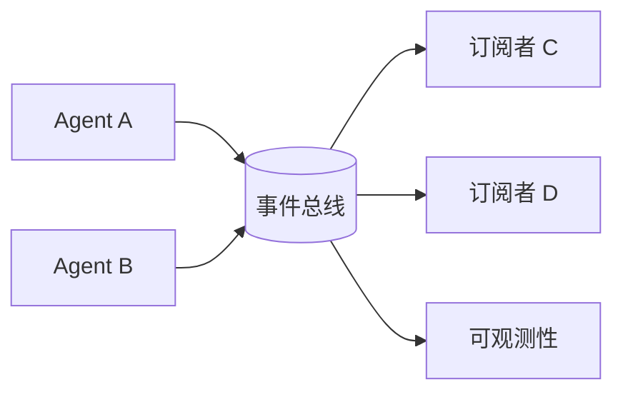

# 事件总线 / 发布-订阅

## 定义

Agent 通过事件、主题和队列进行异步通信，而不是通过直接函数调用。

**类别**：信息流

## 结构



## 适用场景

平台级异步任务、长时间运行的工作、可观测性、跨服务 Agent 编排。

## 不适用场景

简单的同步任务，或缺乏事件 schema 治理的组织。

## 实现方法

1. 设计统一的事件信封：`event_id, run_id, session_id, type, payload, timestamp`。
2. 为每种事件类型定义 schema 和版本。
3. 每个 Agent 操作都发布事件；编排器从日志中恢复状态。
4. 支持回放、去重、幂等性和死信队列。

## 最小化伪代码

```ts
type AgentEvent = {
  id: string;
  runId: string;
  sessionId: string;
  type: string;
  actor: string;
  payload: unknown;
  ts: string;
  schemaVersion: string;
};

interface EventBus {
  publish(event: AgentEvent): void;
  subscribe(type: string, handler: (event: AgentEvent) => void): void;
  replay(fromTs: string): AsyncIterable<AgentEvent>;
}

// 发布者
await bus.publish({ type: "task.completed", actor: "agent-a", payload: result, ... });

// 订阅者
bus.subscribe("task.completed", async (event) => {
  await agentB.handle(event.payload);
});
```

## 推荐的追踪事件

- `event.published`
- `event.consumed`
- `event.replayed`
- `event.dead_lettered`

## 常见失败模式

- 事件缺少 schema 定义。
- 重复消费导致重复副作用。
- 异步流水线难以调试。
- 事件量过大但未进行采样。

## 实现检查清单

- [ ] 输入/输出 schema 已定义。
- [ ] 每个 Agent 的权限边界已定义。
- [ ] 每次 Agent 调用都携带 run id / trace id。
- [ ] 失败、超时、取消和重试策略已定义。
- [ ] 传递的上下文为最小必要信息，而非完整历史记录。
- [ ] 高风险操作由审批或验证器把关。

## 参考资料

- [Microsoft Agent Framework](https://learn.microsoft.com/en-us/agent-framework/overview/)
- [Survey of communication](https://arxiv.org/html/2502.14321v2)