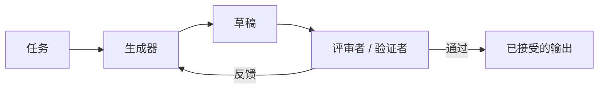

# 生成器-评审者 / 验证者

## 定义

一个Agent负责生成；另一个负责评审、验证、评分或提出修订建议。

**分类**：决策

## 结构



## 适用场景

代码生成 + 审查、文档起草 + 编辑、方案生成 + 验证、测试修复循环。

## 不适用场景

当评审者没有额外的信息或工具时——它只会重复生成器的偏见。

## 实现方法

1. 评审者的提示词和工具必须与生成器不同。
2. 评审者的输出应为结构化格式：问题、严重程度、证据、建议修复方案。
3. 对于代码类任务，评审者应尽可能运行测试、lint检查和diff对比。
4. 生成器根据反馈进行修订，最多迭代N次。

## 最简伪代码

```ts
let draft = await generator.run(task);
for (let i = 0; i < maxIterations; i++) {
  const review = await critic.review({ task, draft });
  if (review.passed) return draft;
  draft = await generator.revise({ task, draft, review });
}
return { draft, warning: "max iterations reached" };
```

## 推荐的追踪事件

- `generator.draft.created`
- `critic.review.completed`
- `critic.issue.found`
- `draft.revised`

## 常见失败模式

- 评审者只做风格评论，未进行事实验证。
- 循环迭代但无实质改进。
- 评审者和生成器共享相同上下文，产生关联性错误。

## 实现检查清单

- [ ] 输入/输出schema已定义。
- [ ] 每个Agent的权限边界已定义。
- [ ] 每次Agent调用都携带 run id / trace id。
- [ ] 失败、超时、取消和重试策略已定义。
- [ ] 传递的上下文为最小必要信息，而非完整历史记录。
- [ ] 高风险操作由审批或验证者把关。

## 参考文献

- [Google ADK patterns](https://developers.googleblog.com/developers-guide-to-multi-agent-patterns-in-adk/)
- [Google architecture patterns](https://docs.cloud.google.com/architecture/choose-design-pattern-agentic-ai-system)