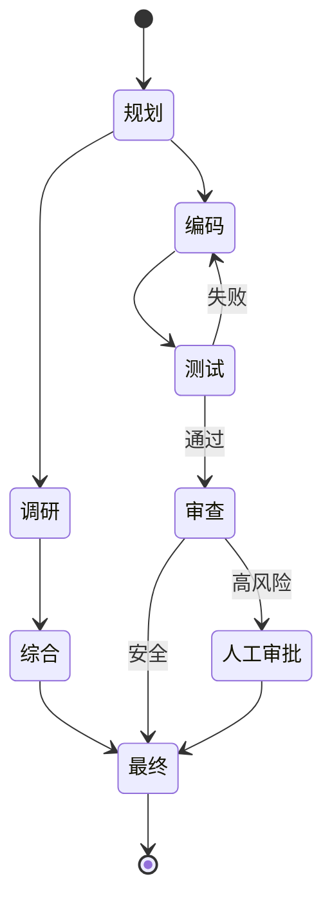

# 图/状态机/工作流

## 定义

将 Agent 流程建模为显式的图、状态机或工作流——而非让 LLM 决定每一次状态转换。

**类别**：控制结构

## 结构



## 适用场景

生产系统、可恢复任务、长时间运行的工作、需要审计追踪和权限边界的 Agent 平台。

## 不适用场景

轻量级 demo、纯聊天、流程完全未知的探索性任务。

## 实现方法

1. 将流程建模为 `节点 + 边 + 状态`。
2. LLM 可以选择边，但不能绕过状态机约束。
3. 每个节点都应可重放、可恢复、可取消。
4. 图状态中存储消息、工具调用、任务状态和权限状态。

## 最小化伪代码

```ts
// 节点名与状态图一一对应
type Node = "plan" | "research" | "synthesize" | "code" | "test" | "review" | "approval" | "final";
type State = { node: Node; [key: string]: unknown };
type Route = (state: State) => Node;

async function runGraph(initial: State, route: Route): Promise<State> {
  let state = initial;
  while (state.node !== "final") {
    const output = await runNode(state.node, state);
    state = checkpoint({ ...state, ...output });
    state.node = route(state);
  }
  return state;
}
```

## 推荐的追踪事件

- `workflow.node.enter`
- `workflow.node.exit`
- `workflow.edge.selected`
- `workflow.checkpoint.created`

## 常见失败模式

- 图过于僵化，Agent 丧失灵活性。
- 状态字段分散，导致恢复困难。
- LLM 路由与业务规则冲突。

## 实现检查清单

- [ ] 输入/输出 schema 已定义。
- [ ] 每个 Agent 的权限边界已定义。
- [ ] 每次 Agent 调用都携带 run id / trace id。
- [ ] 失败、超时、取消和重试策略已定义。
- [ ] 传递的上下文为所需最小量，而非完整历史。
- [ ] 高风险操作设有审批或验证器把关。

## 参考资料

- [Microsoft Agent Framework](https://learn.microsoft.com/en-us/agent-framework/overview/)
- [Google architecture patterns](https://docs.cloud.google.com/architecture/choose-design-pattern-agentic-ai-system)
- [LangChain multi-agent](https://docs.langchain.com/oss/python/langchain/multi-agent)