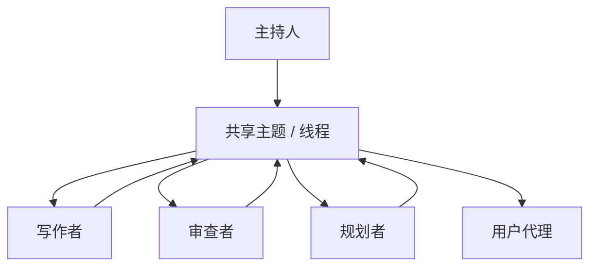

# 群聊 / 会议

## 定义

多个 Agent 共享单个消息线程或主题。由规则、LLM 选择器或人类主持人决定谁下一个发言。

**类别**：信息流

## 结构



## 适用场景

头脑风暴、架构评审、多视角讨论、模拟产品/设计/工程会议。

## 不适用场景

当需要确定性流程、低成本、强审计追踪或严格权限边界时。

## 实现方法

1. 定义参与者、角色、发言者选择规则和终止条件。
2. 使用主持人选择下一个发言者——轮询、基于规则或 LLM 选择器。
3. 仅在共享线程中保留必要信息；修剪离题消息。
4. 定期总结线程以控制 token 用量。

## 最小化伪代码

```ts
while (!termination(thread)) {
  const speaker = await moderator.selectSpeaker(thread, agents);
  const msg = await speaker.reply(thread);
  thread.append({ speaker: speaker.name, content: msg });
}
return summarizer.run(thread);
```

## 推荐的追踪事件

- `groupchat.speaker.selected`
- `groupchat.message.appended`
- `groupchat.terminated`
- `groupchat.summary.created`

## 常见失败模式

- 对话偏离主题。
- Token 成本快速增长。
- 弱势 Agent 被强势者裹挟。
- 未产生具体产出物。

## 实现检查清单

- [ ] 已定义输入/输出 schema。
- [ ] 已定义每个 Agent 的权限边界。
- [ ] 每个 Agent 调用携带 run id / trace id。
- [ ] 已定义失败、超时、取消和重试策略。
- [ ] 传递的上下文为所需最小集，而非完整历史。
- [ ] 高风险操作由审批或验证器把关。

## 参考资料

- [AutoGen 模式](https://microsoft.github.io/autogen/0.2/docs/tutorial/conversation-patterns/)
- [AutoGen 群聊](https://microsoft.github.io/autogen/stable/user-guide/core-user-guide/design-patterns/group-chat.html)