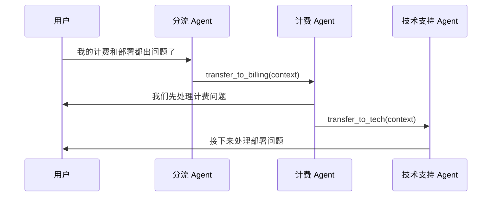

# 交接 / 路由 / 转移模式

## 定义

活跃 Agent 将对话控制权转移给另一个 Agent，后者接管后续的全部交互。

**类别**：控制结构

## 结构



## 适用场景

客服/售后分流、领域专家切换、需要专家直接向用户提问的多轮工作流。

## 不适用场景

子任务只是一次性查询，或交接标准模糊导致对话不断弹跳时。

## 实现方法

1. 每个 Agent 声明自己接受的 `handoff_intents`（交接意图）。
2. 交接不是函数调用——它改变哪个 Agent 处于活跃状态。
3. 传递精简上下文：用户目标、已完成项、待处理项、权限边界。
4. 设置最大交接次数并检测循环。
5. 记录每次交接的 `来源 / 目标 / 原因 / 上下文摘要`。

## 最小化伪代码

```ts
async function maybeHandoff(state: SessionState) {
  const decision = await router.classify(state.lastMessage, state.activeAgent);
  if (decision.type === "handoff") {
    if (hasLoop(state.handoffHistory, decision.to)) {
      throw new HandoffLoopError(state.handoffHistory, decision.to);
    }
    const newState = {
      ...state,
      activeAgent: decision.to,
      handoffHistory: [...state.handoffHistory, decision]
    };
    // 实际调用目标 Agent 开始处理
    const result = await agentRegistry.get(decision.to).run(state.lastMessage, newState);
    return { ...newState, lastResult: result };
  }
  return state;
}
```

## 推荐的追踪事件

- `handoff.requested`
- `handoff.accepted`
- `handoff.rejected`
- `handoff.loop_detected`

## 常见失败模式

- 交接原因未记录 → 无法调试。
- 传递了完整上下文，污染了接收方 Agent。
- Agent 之间出现循环交接。
- 用户不知道当前面对的是哪个 Agent。

## 实现检查清单

- [ ] 输入/输出 schema 已定义。
- [ ] 每个 Agent 的权限边界已定义。
- [ ] 每次 Agent 调用均携带 run id / trace id。
- [ ] 失败、超时、取消和重试策略已定义。
- [ ] 传递的上下文为最小必要内容，而非完整历史。
- [ ] 高风险操作需要审批或验证器把关。

## 参考资料

- [OpenAI 交接](https://openai.github.io/openai-Agent-python/handoffs/)
- [LangChain 交接](https://docs.langchain.com/oss/python/langchain/multi-agent/handoffs)