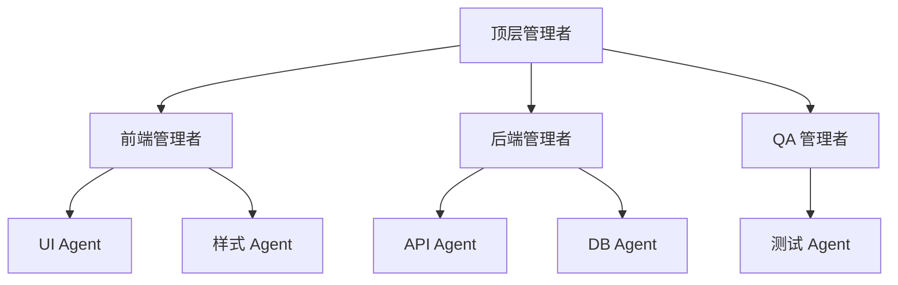

# 层级分解

## 定义

一种多层管理者-执行者结构。上层负责规划与分解；下层负责执行，并可自行进一步分解。

**类别**：控制结构

## 结构



## 适用场景

大型工程项目、长时间运行的任务、跨团队协作、企业流程自动化。

## 不适用场景

小型任务、低延迟任务、任务边界不清晰的开放式对话。

## 实现方法

1. 每层只处理自己层级的事务——不可跨层微观管理下层执行者。
2. 每个子任务都应有明确的验收标准和输出 schema。
3. 限制递归深度和每层的扇出数量。
4. 上层只接收摘要、证据和状态——而非执行者的完整上下文。

## 最小化伪代码

```ts
async function decompose(node: TaskNode, depth = 0) {
  if (depth > MAX_DEPTH || node.isAtomic()) return worker.run(node);
  const children = await manager.plan(node);
  const results = await Promise.all(children.map(c => decompose(c, depth + 1)));
  return manager.aggregate(node, results);
}
```

## 推荐的追踪事件

- `hierarchy.node.created`
- `hierarchy.node.assigned`
- `hierarchy.node.completed`
- `hierarchy.depth_limited`

## 常见失败模式

- 层级过深导致高延迟。
- 顶层计划出错会波及所有下层分支。
- 执行者的失败被管理者的摘要掩盖。

## 实现检查清单

- [ ] 输入/输出 schema 已定义。
- [ ] 每个 Agent 的权限边界已定义。
- [ ] 每次 Agent 调用都携带 run id / trace id。
- [ ] 失败、超时、取消和重试策略已定义。
- [ ] 传递的上下文为所需最小量，而非完整历史。
- [ ] 高风险操作设有审批或验证器把关。

## 参考资料

- [Google ADK patterns](https://developers.googleblog.com/developers-guide-to-multi-agent-patterns-in-adk/)
- [Survey of communication](https://arxiv.org/html/2502.14321v2)