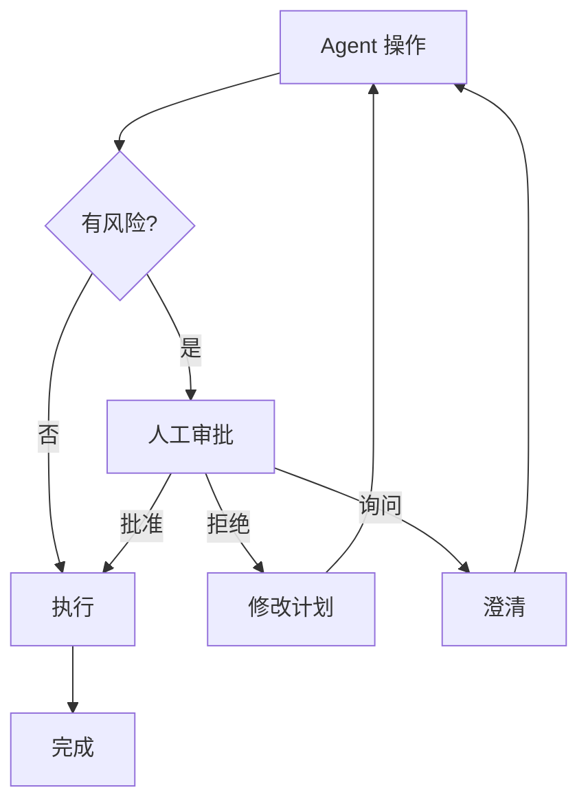

# 人在回路 (Human-in-the-loop)

## 定义

将人类视为一个特殊 Agent，参与审批、纠正、路由、中断或最终决策。

**类别**：执行环境

## 结构



## 适用场景

高风险操作：shell、文件写入、commit、部署、金融操作、法律相关、隐私相关、权限变更。

## 不适用场景

完全自动化、低风险的内部起草工作。

## 实现方法

1. 定义操作风险等级：`read / write / shell / network / deploy / payment`。
2. 高风险操作进入审批队列。
3. 审批卡片必须展示：操作、原因、范围、回滚计划。
4. 人类反馈回流到 Agent 状态中——而非仅作为外部评论。

## 最小化伪代码

```ts
if (policy.requiresApproval(action)) {
  const approval = await humanApproval.request({ action, reason, rollback });
  if (!approval.granted) return revisePlan(approval.feedback);
}
return execute(action);
```

## 推荐的追踪事件

- `approval.requested`
- `approval.granted`
- `approval.rejected`
- `approval.timeout`

## 常见失败模式

- 审批请求未携带足够上下文以做出真正决策。
- 所有操作都需要审批，系统变得不可用。
- 审批后没有上下文和问责记录。

## 实现检查清单

- [ ] 定义输入/输出 schema。
- [ ] 定义每个 Agent 的权限边界。
- [ ] 每个 Agent 调用携带 run id / trace id。
- [ ] 定义失败、超时、取消和重试策略。
- [ ] 传递的上下文为所需的最小量，而非完整历史。
- [ ] 高风险操作由审批或验证器把关。

## 参考资料

- [Google ADK patterns](https://developers.googleblog.com/developers-guide-to-multi-agent-patterns-in-adk/)
- [Microsoft Agent Framework](https://learn.microsoft.com/en-us/agent-framework/overview/)