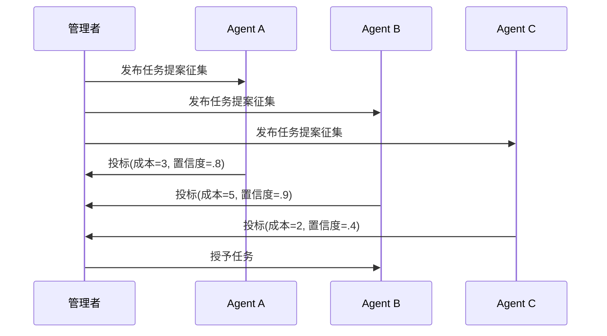

# 市场 / 拍卖 / 合同网

## 定义

Agent 通过竞标、定价或合同网协议（Contract Net Protocol）来分配任务和资源。

**类别**：决策

## 结构



## 适用场景

资源调度、工具成本优化、机器人任务分配、多 Agent 负载均衡。

## 不适用场景

投标不可信、任务过于微小或协商成本超过执行成本时。

## 实现方法

1. 管理者发布任务公告，包含目标、约束条件、预算和验收标准。
2. Agent 返回投标信息：成本、预计完成时间、置信度、所需权限。
3. 管理者通过评分函数选择中标者。
4. 任务完成后更新 Agent 信誉——防止长期低报。

## 最小化伪代码

```ts
const bids = await Promise.all(agents.map(a => a.bid(task)));
const winner = rank(bids, b => b.confidence / Math.max(b.cost, 1))[0];
const result = await winner.agent.run(task);
reputation.update(winner.agent, result);
```

## 推荐的追踪事件

- `auction.announced`
- `auction.bid.received`
- `auction.awarded`
- `auction.completed`

## 常见失败模式

- Agent 低估成本。
- 评分函数被投机利用，而非真正解决问题。
- 协商消耗的 token 占据预算大头。

## 实现检查清单

- [ ] 输入/输出 schema 已定义。
- [ ] 每个 Agent 的权限边界已定义。
- [ ] 每个 Agent 调用携带 run id / trace id。
- [ ] 失败、超时、取消和重试策略已定义。
- [ ] 传递的上下文为最小必要信息，而非完整历史。
- [ ] 高风险操作需经过审批或验证器把关。

## 参考资料

- [Smith, R.G. (1980) — The Contract Net Protocol 原始论文](https://doi.org/10.1109/TC.1980.1675516)
- [Beyond Self-Talk: A Communication-Centric Survey of LLM-Based Multi-Agent Systems (Yan et al., 2025)](https://arxiv.org/html/2502.14321v2)