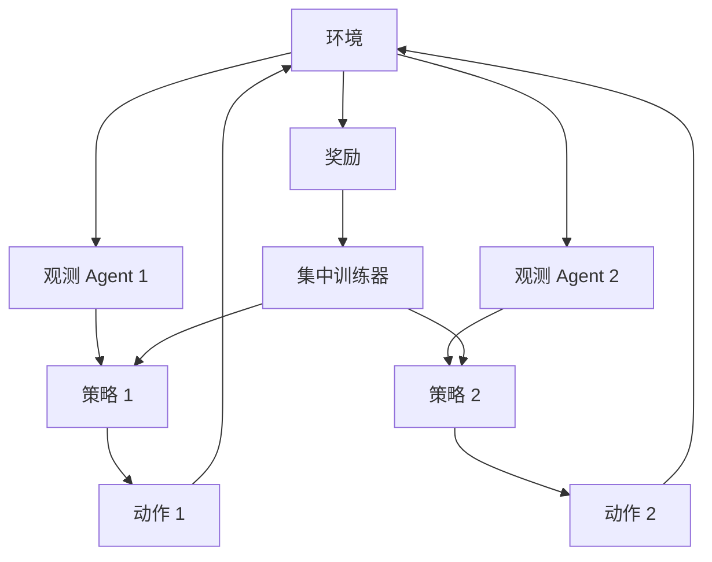

# MARL / CTDE (多 Agent 强化学习)

## 定义

多 Agent 强化学习（Multi-Agent Reinforcement Learning）通过奖励机制训练多个 Agent 在环境中协作或竞争。CTDE 即**集中训练**（Centralized Training）、**分散执行**（Decentralized Execution）。

**类别**：学习

## 结构



## 适用场景

机器人学、游戏、交通、调度、控制系统、多 Agent 协同决策研究。

## 不适用场景

日常 LLM 编程 Agent 编排。如果你无法定义奖励函数和仿真器，就不要用 MARL。

## 实现方法

1. 定义环境、观测空间、动作空间、奖励和回合。
2. 选择训练范式：CTE（集中训练集中执行）、CTDE（集中训练分散执行）或 DTE（分散训练分散执行）。
3. 训练时可使用全局状态，执行时仅使用局部观测。
4. 对于 LLM Agent 平台，MARL 更适合策略研究而非作为主运行时。

## 最小化伪代码

```ts
for (const episode of episodes) {
  let obs = env.reset();
  while (!env.done()) {
    const actions = agents.map((a, i) => a.policy(obs[i]));
    const { nextObs, rewards } = env.step(actions);
    trainer.update({ obs, actions, rewards, nextObs });
    obs = nextObs;
  }
}
```

## 推荐的追踪事件

- `marl.episode.started`
- `marl.step.completed`
- `marl.reward.received`
- `marl.policy.updated`

## 常见失败模式

- 奖励函数定义不准确。
- 训练环境与生产环境不匹配。
- 将 MARL 与通用 LLM 编排混淆。

## 实现检查清单

- [ ] 定义触发和退出条件。
- [ ] 定义输入/输出 schema。
- [ ] 定义权限、预算、超时和重试策略。
- [ ] 定义追踪事件。
- [ ] 定义降级或人工接管策略。

## 参考资料

- [MARL / CTDE intro](https://arxiv.org/abs/2409.03052)
- [MARL survey](https://arxiv.org/abs/2405.06161v2)