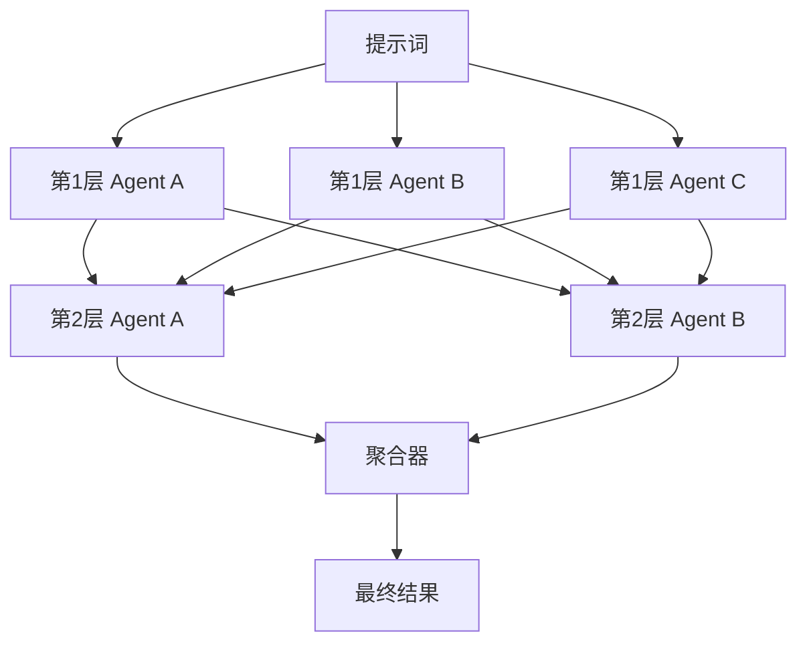

# 混合代理 / 分层集成

## 定义

多个模型或 Agent 分层生成输出；每后续层读取前一层多个输出并加以改进。

**类别**：决策

## 结构



## 适用场景

多模型融合、高质量生成、创意任务、答案综合。

## 不适用场景

低延迟任务、需要实际工具执行的任务或预算敏感的工作负载。

## 实现方法

1. 第一层使用多样化的模型/prompt，避免输出同质化。
2. 后续层读取前序输出，而非仅原始 prompt。
3. 聚合器负责去重、冲突解决和质量排序。
4. 限制层数——通常 2 到 3 层足够。

## 最小化伪代码

```ts
let layerOutputs = await Promise.all(layer1.map(a => a.run(prompt)));
for (const layer of nextLayers) {
  layerOutputs = await Promise.all(layer.map(a => a.run({ prompt, previous: layerOutputs })));
}
return aggregator.run({ prompt, candidates: layerOutputs });
```

## 推荐的追踪事件

- `moa.layer.started`
- `moa.agent.output`
- `moa.layer.completed`
- `moa.aggregated`

## 常见失败模式

- 模型输出相关性过高，增益趋平。
- 延迟和成本膨胀。
- 聚合器合并了相互冲突的结论。

## 实现检查清单

- [ ] 输入/输出 schema 已定义。
- [ ] 每个 Agent 的权限边界已定义。
- [ ] 每个 Agent 调用携带 run id / trace id。
- [ ] 失败、超时、取消和重试策略已定义。
- [ ] 传递的上下文为最小必要信息，而非完整历史。
- [ ] 高风险操作需经过审批或验证器把关。

## 参考资料

- [Mixture-of-Agents Enhances Large Language Model Capabilities (Wang et al., 2024)](https://arxiv.org/abs/2406.04692)
- [Self-Consistency Improves Chain of Thought Reasoning in Language Models (Wang et al., ICLR 2023)](https://arxiv.org/abs/2203.11171)