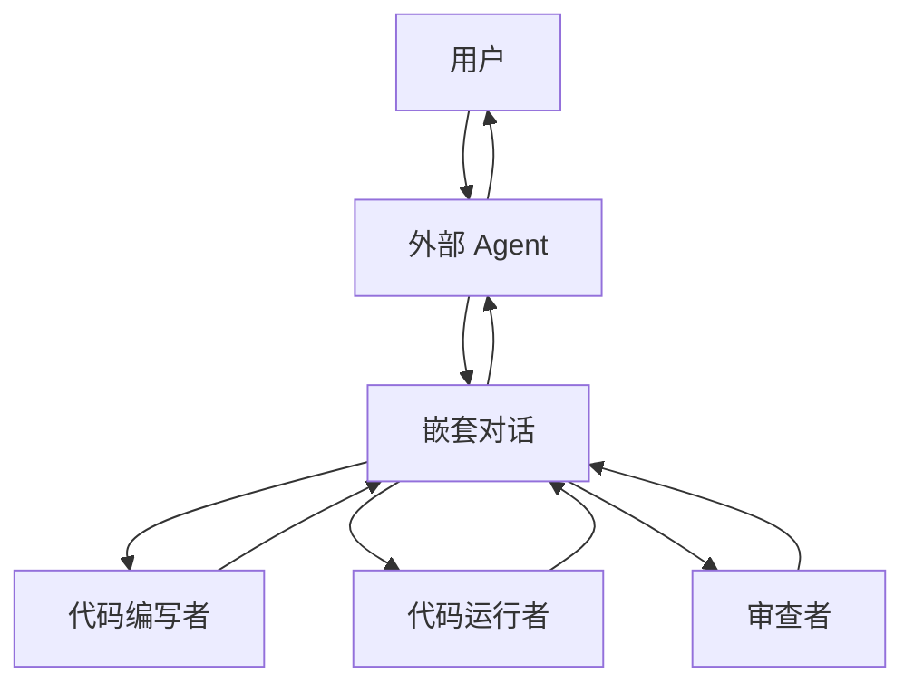

# 嵌套对话 / 内部团队

## 定义

在向外部回复之前，一个 Agent 启动一个小型内部多 Agent 对话来完成复杂的子流程。

**类别**：信息流

## 结构



## 适用场景

将复杂流程封装为单个 Agent 、内部审查/测试循环、可复用的专家团队。

## 不适用场景

当用户需要看到每个中间步骤时，或当内部团队的成本不可控时。

## 实现方法

1. 外部 Agent 在启动嵌套对话前必须有明确的触发条件。
2. 嵌套对话有自己的记忆和终止条件。
3. 外部 Agent 只接收结构化摘要，而非完整的内部对话记录。
4. 追踪应保留嵌套 run id，以便展开查看。

## 最小化伪代码

```ts
async function outerReply(message) {
  if (needsInternalReview(message)) {
    const inner = await nestedTeam.run({ task: message, maxTurns: 6 });
    return outerAgent.finalize({ message, innerSummary: inner.summary });
  }
  return outerAgent.reply(message);
}
```

## 推荐的追踪事件

- `nested_chat.started`
- `nested_chat.turn`
- `nested_chat.completed`
- `nested_chat.summary.returned`

## 常见失败模式

- 内部对话不可见，难以审计。
- 外部 Agent 过于激进地触发嵌套对话。
- 内部团队的输出未经验证。

## 实现检查清单

- [ ] 已定义输入/输出 schema。
- [ ] 已定义每个 Agent 的权限边界。
- [ ] 每个 Agent 调用携带 run id / trace id。
- [ ] 已定义失败、超时、取消和重试策略。
- [ ] 传递的上下文为所需最小集，而非完整历史。
- [ ] 高风险操作由审批或验证器把关。

## 参考资料

- [AutoGen 模式](https://microsoft.github.io/autogen/0.2/docs/tutorial/conversation-patterns/)