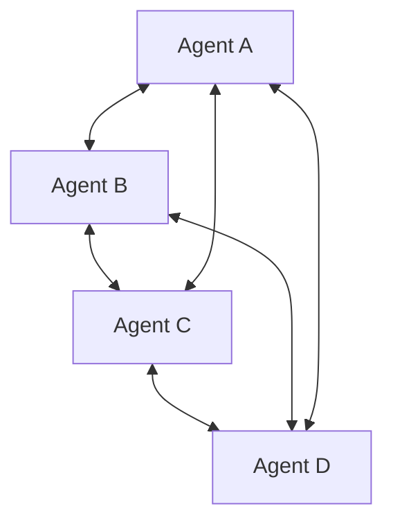

# 点对点/群体协作

## 定义

不存在固定的协调者。Agent 通过直接通信、共享环境或动态交接实现自组织。

**分类**：控制结构

## 结构



## 适用场景

开放世界、去中心化网络、动态探索、研究系统、自治 agent 社会。

## 不适用场景

企业生产流程、权限严格的环境、任何需要强审计和确定性的场景。

## 实现方法

1. 每个 agent 维护本地状态和邻居列表。
2. 使用消息协议；不依赖单一协调者。
3. 设置 TTL、已访问集合和预算以防止消息泛滥。
4. 需要全局结果时，引入临时聚合器或共识机制。

## 最小化伪代码

```ts
async function receive(msg) {
  if (seen(msg.id) || msg.ttl <= 0) return;
  markSeen(msg.id);
  const local = await act(msg);
  for (const peer of pickPeers(local)) {
    send(peer, { ...msg, ttl: msg.ttl - 1, context: local.summary });
  }
}
```

## 推荐 trace 事件

- `peer.message.sent`
- `peer.message.received`
- `peer.route.selected`
- `swarm.consensus.reached`

## 常见失败模式

- 难以收敛。
- 工作重复。
- 安全边界薄弱。
- 问责困难。

## 实现 checklist

- [ ] 输入/输出 schema 已定义。
- [ ] 每个 agent 的权限边界已定义。
- [ ] 每次 agent 调用都携带 run id / trace id。
- [ ] 失败、超时、取消和重试策略已定义。
- [ ] 传递的上下文为所需最小量，而非完整历史。
- [ ] 高风险操作设有审批或验证者把关。

## 参考文献

- [Survey of communication](https://arxiv.org/html/2502.14321v2)