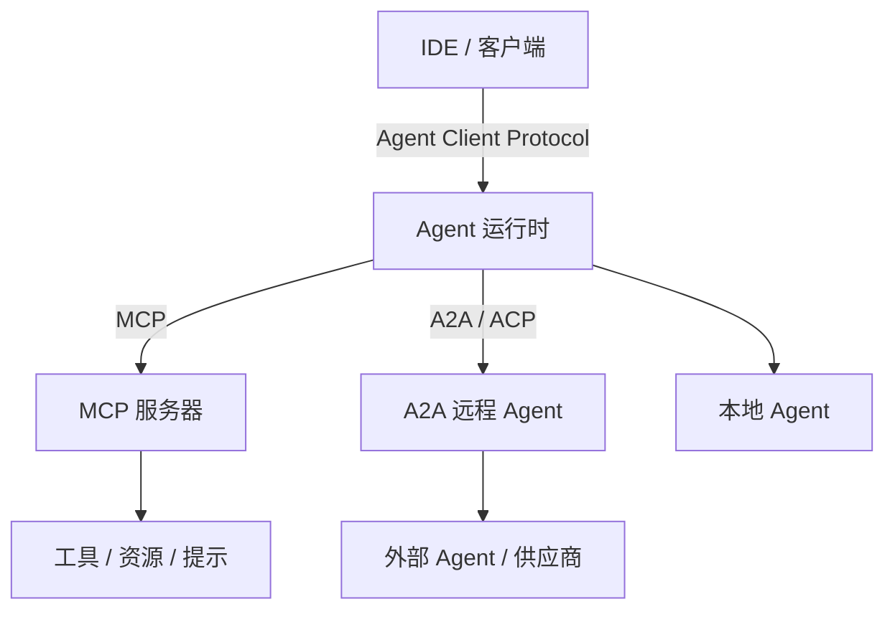

# 协议中介的 Agent 网络

## 定义

使用四类标准协议，跨框架和供应商连接工具、Agent 、客户端和平台：

- **MCP**（Model Context Protocol）：Agent ↔ 工具/资源
- **A2A**（Agent-to-Agent Protocol）：Agent ↔ 远程 Agent
- **ACP**（Agent Communication Protocol）：Agent 间通信（由 BeeAI/IBM 发起，已并入 A2A）
- **Agent Client Protocol**：IDE/客户端 ↔ 编码 Agent（独立协议，见 agentclientprotocol.com）

**类别**：协议互联

## 结构



## 适用场景

跨框架互操作、企业集成、IDE 到编码 Agent 、工具生态标准化。

## 不适用场景

单体演示项目、所有工具均为本地且无需标准化的环境。

## 实现方法

1. MCP 用于 Agent 到工具/资源的调用——不要复用它进行 Agent 间通信。
2. A2A（含原 ACP）处理 Agent 发现、任务、消息和协作。
3. Agent Client Protocol 标准化 IDE/客户端到编码 Agent 的连接——这是一个独立协议，与 ACP 无关。
4. 所有协议边界都需要认证、授权、审计和速率限制。

## 最小化伪代码

```ts
interface AgentRuntimePorts {
  mcp: MCPClient;                 // 工具 / 资源 / 提示
  a2a: AgentDirectoryClient;      // 远程 agent
  client: AgentClientServer;      // IDE / Web / CLI
  events: EventBus;               // 可观测性
}
```

## 推荐的追踪事件

- `protocol.mcp.tool_call`
- `protocol.a2a.task.created`
- `protocol.client.session.started`
- `protocol.auth.failed`

## 常见失败模式

- 将 MCP、A2A 和 ACP 混为一谈。
- 外部 Agent 被授予过多权限。
- 缺少身份认证或审计。

## 实现检查清单

- [ ] 输入/输出 schema 已定义。
- [ ] 每个 Agent 的权限边界已定义。
- [ ] 每次 Agent 调用都携带 run id / trace id。
- [ ] 失败、超时、取消和重试策略已定义。
- [ ] 传递的上下文为最小必要量，而非完整历史。
- [ ] 高风险操作有审批或验证器把关。

## 参考资料

- [MCP 规范](https://modelcontextprotocol.io/specification/2025-06-18)
- [MCP 工具](https://modelcontextprotocol.io/specification/2025-06-18/server/tools)
- [A2A 文档](https://a2a-protocol.org/latest/)
- [A2A — Google 博客](https://developers.googleblog.com/en/a2a-a-new-era-of-agent-interoperability/)
- [Agent Client Protocol](https://agentclientprotocol.com/get-started/introduction)