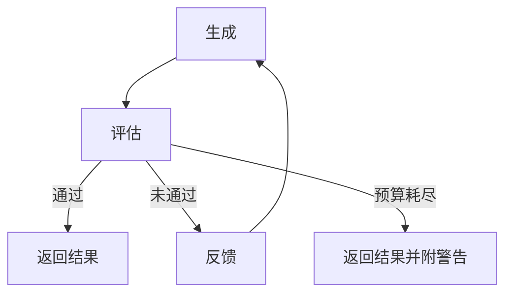

# 迭代优化循环 / 评估器-优化器

## 定义

循环迭代"生成 → 评估 → 修正"过程，直到满足退出条件或预算耗尽。

**类别**：决策

## 结构



## 适用场景

测试驱动的代码修复、文档润色、prompt 优化、方案迭代、质量门槛。

## 不适用场景

没有明确的评估标准、没有定义的退出条件或预算紧张时。

## 实现方法

1. 预先定义退出条件：测试通过、评分超过阈值、人工审批、无新问题产生。
2. 每轮仅修正明确的失败点——避免反复振荡。
3. 记录每轮的差异、评分、反馈和成本。
4. 达到最大轮次时，返回当前状态和未解决问题。

## 最小伪代码

```ts
for (let round = 1; round <= maxRounds; round++) {
  const output = await worker.run(state);
  const evalResult = await evaluator.run(output);
  logRound(round, output, evalResult);
  if (evalResult.pass) return output;
  state = applyFeedback(state, evalResult.feedback);
}
return { status: "incomplete", state };
```

## 推荐的追踪事件

- `loop.round.started`
- `loop.evaluation.completed`
- `loop.exit.pass`
- `loop.exit.budget_exceeded`

## 常见失败模式

- 退出条件模糊导致无限循环。
- 每轮引入新的 bug。
- 系统优化的是评估器的评分，而非真正目标。

## 实现检查清单

- [ ] 输入/输出 schema 已定义。
- [ ] 每个 agent 的权限边界已定义。
- [ ] 每个 agent 调用携带 run id / trace id。
- [ ] 失败、超时、取消和重试策略已定义。
- [ ] 传递的上下文为最小必要信息，而非完整历史。
- [ ] 高风险操作需经过审批或验证器把关。

## 参考文献

- [Google ADK patterns](https://developers.googleblog.com/developers-guide-to-multi-agent-patterns-in-adk/)
- [Google architecture patterns](https://docs.cloud.google.com/architecture/choose-design-pattern-agentic-ai-system)