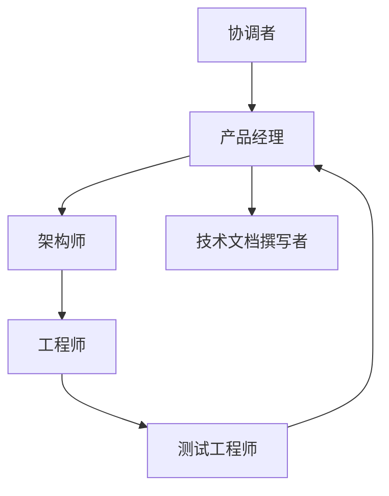

# 角色扮演 / SOP / 虚拟公司

## 定义

为 Agent 分配专业角色——产品经理、架构师、开发工程师、测试工程师——并通过标准操作流程（SOP）约束其协作。

**类别**：执行环境

## 结构



## 适用场景

虚拟软件公司、产品设计、教学模拟、组织流程自动化。

## 不适用场景

角色仅为装饰——没有工具、没有验收标准时。

## 实现方法

1. 每个角色声明职责边界、允许的工具以及输入/输出格式。
2. SOP 编码为工作流，而非仅埋在 prompt 中。
3. 角色交接产出的是制品，而非仅仅是聊天日志。
4. 对于软件开发任务，接入真实的测试执行和代码运行。

## 最小化伪代码

```ts
const sop = [
  { role: "PM", output: "requirements.md" },
  { role: "Architect", output: "design.md" },
  { role: "Engineer", output: "patch.diff" },
  { role: "Tester", output: "test-report.md" },
];

let artifacts = {};
for (const step of sop) {
  const result = await role(step.role).run({ ...step, context: artifacts });
  artifacts[step.output] = result;
  // QA 失败时回退到 PM 重新评估需求
  if (step.role === "Tester" && !result.passed) {
    artifacts = await role("PM").revise(artifacts, result.issues);
  }
}
```

## 推荐的追踪事件

- `role.task.started`
- `role.artifact.created`
- `sop.step.completed`
- `sop.violation.detected`

## 常见失败模式

- Agent 扮演角色出色但不产出实际成果。
- SOP 膨胀，导致长度和成本失控。
- 角色输出未遵循一致的制品格式。

## 实现检查清单

- [ ] 定义输入/输出 schema。
- [ ] 定义每个 Agent 的权限边界。
- [ ] 每个 Agent 调用携带 run id / trace id。
- [ ] 定义失败、超时、取消和重试策略。
- [ ] 传递的上下文为所需的最小量，而非完整历史。
- [ ] 高风险操作由审批或验证器把关。

## 参考资料

- [Survey: LLM-based multi-agent](https://arxiv.org/html/2412.17481v2)
- [ChatDev: Communicative Agents for Software Development (Qian et al., 2023)](https://arxiv.org/abs/2307.07924)
- [MetaGPT: Meta Programming for A Multi-Agent Collaborative Framework (Hong et al., 2023)](https://arxiv.org/abs/2308.00352)