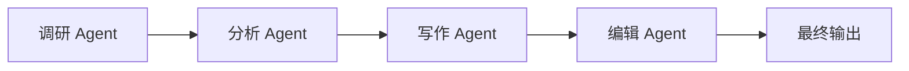

# 顺序流水线

## 定义

任务按固定顺序经过多个 Agent；每一步的输出成为下一步的输入。

**类别**：信息流

## 结构



## 适用场景

调研 → 分析 → 写作，需求 → 设计 → 构建 → 测试，ETL 式的明确流程。

## 不适用场景

任务结构未知，或需要大量动态分支或并行探索时。

## 实现方法

1. 将流程建模为固定步骤；每步声明输入/输出 schema。
2. 验证每步的输出——不要在步骤间传递原始自然语言。
3. 失败时允许按步骤重试，而非重新运行整个流水线。
4. 在关键节点插入验证器或人工审批。

## 最小化伪代码

```ts
const pipeline = [researchAgent, analystAgent, writerAgent, editorAgent];
let output = userTask;
for (const agent of pipeline) {
  try {
    output = await agent.run(output);
    validate(agent.outputSchema, output);
  } catch (err) {
    // 按步骤重试，而非重跑整个流水线
    output = await retry(agent, output);
  }
}
return output;
```

## 推荐的追踪事件

- `pipeline.started`
- `pipeline.step.started`
- `pipeline.step.completed`
- `pipeline.completed`

## 常见失败模式

- 上游幻觉被下游重新包装，显得更加可信。
- 固定流程不适应动态任务。
- 缺少按步骤的检查点。

## 实现检查清单

- [ ] 输入/输出 schema 已定义。
- [ ] 每个 Agent 的权限边界已定义。
- [ ] 每次 Agent 调用都携带 run id / trace id。
- [ ] 失败、超时、取消和重试策略已定义。
- [ ] 传入的上下文为所需的最小量，而非完整历史。
- [ ] 高风险操作受审批或验证器门控。

## 参考资料

- [Google ADK 模式](https://developers.googleblog.com/developers-guide-to-multi-agent-patterns-in-adk/)
- [AutoGen 模式](https://microsoft.github.io/autogen/0.2/docs/tutorial/conversation-patterns/)