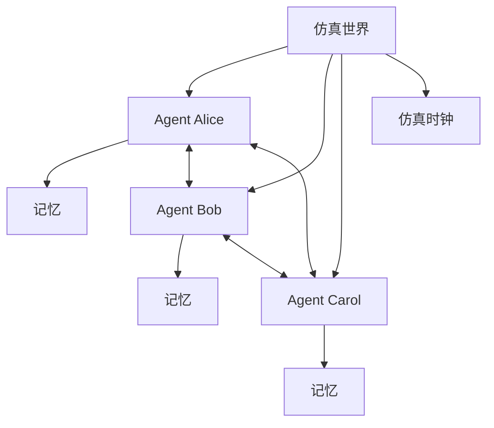

# 社会仿真 / Agent 社会

## 定义

使用多个 Agent 仿真人群、组织、社区或社会系统。关注重点是长期记忆、规划、关系和涌现行为。

**类别**：仿真

## 结构



## 适用场景

用户研究、产品验证、社会行为仿真、游戏 NPC、组织建模、信息传播研究。

## 不适用场景

生产级任务执行、强确定性流程、任何需要编程 Agent 执行实际工作的场景。

## 实现方法

1. 设计世界状态：位置、时间、事件、对象、关系。
2. 每个 Agent 拥有记忆、画像、目标和日常计划。
3. 使用 `观察 → 反思 → 规划 → 行动` 循环。
4. 记录 Agent 交互和世界状态变化。
5. 目标是仿真可信度，而非单任务成功率。

## 最小化伪代码

```ts
async function tick(world) {
  for (const agent of world.agents) {
    const obs = world.observe(agent);
    agent.memory.store(obs);
    const reflection = await agent.reflect();
    const plan = await agent.plan(reflection);
    await world.apply(await agent.act(plan));
  }
}
```

## 推荐的追踪事件

- `simulation.tick.started`
- `agent.observed`
- `agent.reflected`
- `agent.acted`
- `world.state.updated`

## 常见失败模式

- 将仿真结果当作真实预测。
- 人设令人信服但行为未经验证。
- 长期记忆污染后续运行。

## 实现检查清单

- [ ] 定义触发和退出条件。
- [ ] 定义输入/输出 schema。
- [ ] 定义权限、预算、超时和重试策略。
- [ ] 定义追踪事件。
- [ ] 定义降级或人工接管策略。

## 参考资料

- [Generative Agent](https://arxiv.org/abs/2304.03442)