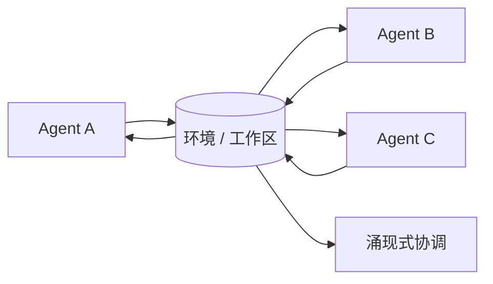

# 共识主动性 / 环境中介协作

## 定义

Agent 之间不直接通信。它们修改环境并留下痕迹；其他 agent 观察这些痕迹并据此行动。对于编程 agent，issue、todo、diff 和测试结果都是环境痕迹。

**类别**：执行环境

## 结构



## 适用场景

机器人学、仿真、制造、共享工作区、异步研究协作——任何不需要直接对话的场景。

## 不适用场景

环境状态不可观测、痕迹没有 schema、或需要强因果解释时。

## 如何实现

1. 结构化环境痕迹：`todo / artifact / test_result / issue / decision`。
2. Agent 定期观察环境变化，而非接收直接消息。
3. 每条痕迹携带来源、时间戳、有效性和可信度信息。
4. 对于编程 agent，将 `TODO.md`、测试报告、git diff 视为共识主动性信号。

## 最小伪代码

```ts
async function agentLoop(agent) {
  const observations = await environment.observe(agent.scope);
  const action = await agent.decide(observations);
  await environment.apply(action);
  await eventBus.publish({
    type: "environment.trace.left",
    actor: agent.id,
    payload: action,
  });
}
```

## 推荐的追踪事件

- `environment.observed`
- `environment.trace.left`
- `environment.trace.consumed`
- `environment.conflict.detected`

## 常见失败模式

- 环境污染。
- Agent 读取到过期痕迹。
- 痕迹过于隐式，调试困难。

## 实施检查清单

- [ ] 定义触发和退出条件。
- [ ] 定义输入/输出 schema。
- [ ] 定义权限、预算、超时和重试策略。
- [ ] 定义追踪事件。
- [ ] 定义降级或人工接管策略。

## 参考文献

- [Survey of communication](https://arxiv.org/html/2502.14321v2)