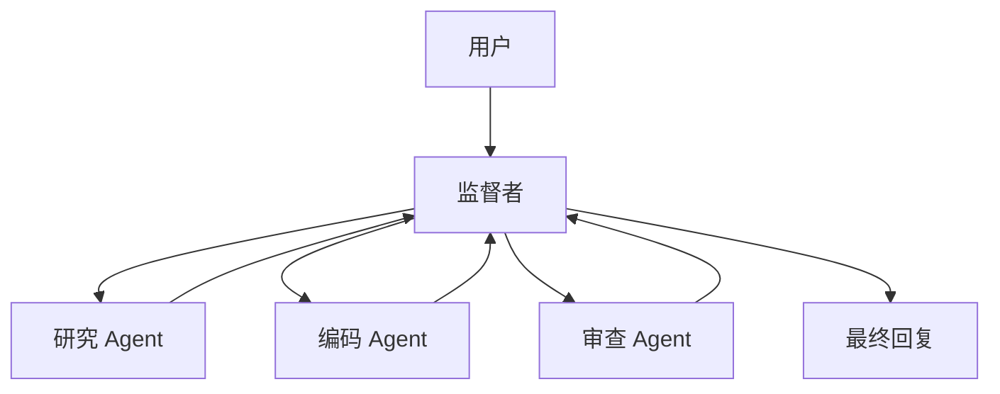

# 监督者 / 管理者模式

## 定义

主 Agent 负责规划、路由和综合汇总结果；其他 Agent 作为专家执行子任务。

**类别**：控制结构

## 结构



## 适用场景

生产系统、任务拆解、客服分流、内部研发平台等任何需要稳定控制和可观测性的场景。

## 不适用场景

开放式探索、Agent 间自由协商，或监督者无法有效评估子任务质量的情况。

## 实现方法

1. 定义一个 `SupervisorAgent`，只负责意图识别、规划、路由和综合汇总——永远不做繁重的执行工作。
2. 每个专家 Agent 拥有独立的指令、工具集、记忆范围和权限。
3. 监督者调用子 Agent 时传递结构化任务：`目标 / 上下文 / 约束 / 期望输出`。
4. 子 Agent 返回结构化结果：`状态 / 答案 / 证据 / 后续操作 / 置信度`。
5. 监督者决定下一步：再次调用、并行分发、进入验证环节、请求用户确认或最终定稿。

## 最小化伪代码

```ts
type AgentResult = {
  status: "success" | "blocked" | "need_input" | "failed";
  answer: string;
  evidence?: string[];
  confidence?: number;
};

async function supervisor(task: UserTask) {
  const plan = await planner.run(task);
  const results = [];
  for (const step of plan.steps) {
    const agent = registry.pick(step.requiredSkill);
    results.push(await agent.run({ goal: step.goal, context: task.context }));
  }
  return synthesizer.run({ task, results });
}
```

## 推荐的追踪事件

- `supervisor.plan.created`
- `agent.task.assigned`
- `agent.result.received`
- `supervisor.synthesis.completed`

## 常见失败模式

- 监督者成为瓶颈；所有错误集中在一个节点上。
- 子 Agent 的输出不可验证；监督者盲目信任。
- 完整上下文被转储到监督者，导致 token 爆炸并擦除权限边界。

## 实现检查清单

- [ ] 输入/输出 schema 已定义。
- [ ] 每个 Agent 的权限边界已定义。
- [ ] 每次 Agent 调用均携带 run id / trace id。
- [ ] 失败、超时、取消和重试策略已定义。
- [ ] 传递的上下文为最小必要内容，而非完整历史。
- [ ] 高风险操作需要审批或验证器把关。

## 参考资料

- [OpenAI Agents — 指南](https://developers.openai.com/api/docs/guides/Agent)
- [LangChain 多 Agent](https://docs.langchain.com/oss/python/langchain/multi-agent)
- [Google ADK 模式](https://developers.googleblog.com/developers-guide-to-multi-agent-patterns-in-adk/)