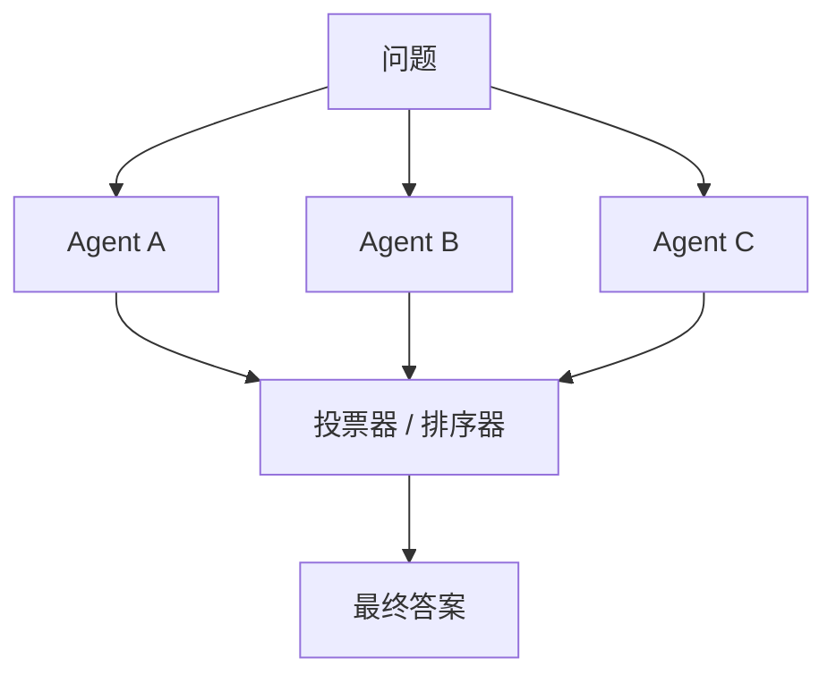

# 投票 / 集成

## 定义

多个 agent 独立产出候选答案；通过投票、排名、评分或验证器选出最终结果。

**类别**：决策

## 结构



## 适用场景

分类、推理问题、多候选方案、事实核查、模型融合、基准评测。

## 不适用场景

候选答案高度相关、所有 agent 共享相同错误来源，或任务需要工具验证而非投票时。

## 实现方法

1. 使用不同模型、prompt、温度参数或工具路径以最大化多样性。
2. 每个候选答案附带推理过程和证据，便于排序器评判。
3. 排序器依据评分标准评判，而非"看起来哪个最好"。
4. 对于可执行任务，用工具验证获胜候选。

## 最小伪代码

```ts
const candidates = await Promise.all(agents.map(a => a.answer(question)));
const scored = await ranker.score({ question, candidates, rubric });
const winner = scored.sort((a, b) => b.score - a.score)[0];
return verifier ? verifier.check(winner) : winner;
```

## 推荐的追踪事件

- `ensemble.candidate.created`
- `ensemble.vote.cast`
- `ensemble.ranked`
- `ensemble.winner.selected`

## 常见失败模式

- 多数意见并非正确。
- 候选答案过于相似。
- 排序器被流畅的表述所欺骗。

## 实现检查清单

- [ ] 触发和退出条件已定义。
- [ ] 输入/输出 schema 已定义。
- [ ] 权限、预算、超时和重试策略已定义。
- [ ] 追踪事件已定义。
- [ ] 降级或人工接管策略已定义。

## 参考文献

- [Survey: LLM-based multi-agent](https://arxiv.org/html/2412.17481v2)
- [Mixture-of-Agents (MoA)](https://arxiv.org/abs/2406.04692)