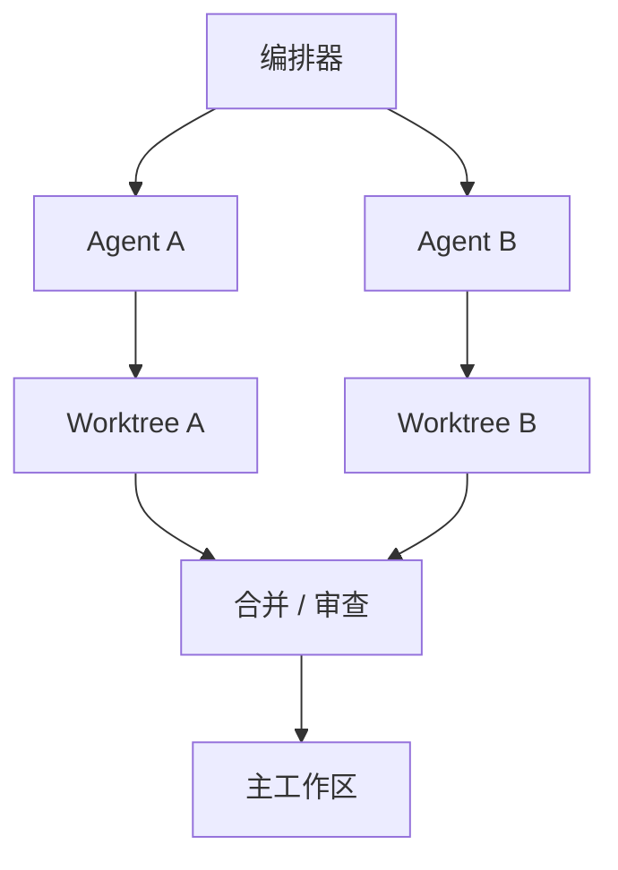

# 工作区 / 沙箱隔离

## 定义

不同 agent 在不同的工作区、git worktree、容器或沙箱中执行，以避免并发破坏。

**类别**：执行环境

## 结构



## 适用场景

编码 agent、多 agent 并发代码变更、实验性方案、危险命令、测试环境隔离。

## 不适用场景

只读任务、简单问答、不涉及文件系统副作用的任何场景。

## 如何实现

1. 每次 agent 运行都创建自己的工作区或 worktree。
2. 文件写入、shell 命令和测试均在隔离环境中运行。
3. 输出以 patch / diff / artifact 形式返回主流程。
4. 合并前由审查者/测试者检查冲突和测试结果。
5. 支持快照、回滚和清理。

## 最小伪代码

```ts
async function runInWorkspace(agent, task) {
  const ws = await workspace.create({ baseRef: task.baseRef });
  try {
    const result = await agent.run({ task, cwd: ws.path });
    const patch = await ws.diff();
    return reviewer.review({ result, patch });
  } finally {
    await ws.cleanup();
  }
}
```

## 推荐的追踪事件

- `workspace.created`
- `workspace.command.executed`
- `workspace.diff.created`
- `workspace.cleaned`

## 常见失败模式

- 多个 agent 写入同一目录。
- 只返回文本摘要，没有 diff。
- 沙箱权限过宽。
- 没有清理策略 → 资源泄漏。

## 实施检查清单

- [ ] 定义触发和退出条件。
- [ ] 定义输入/输出 schema。
- [ ] 定义权限、预算、超时和重试策略。
- [ ] 定义追踪事件。
- [ ] 定义降级或人工接管策略。

## 参考文献

- [Google ADK patterns](https://developers.googleblog.com/developers-guide-to-multi-agent-patterns-in-adk/)