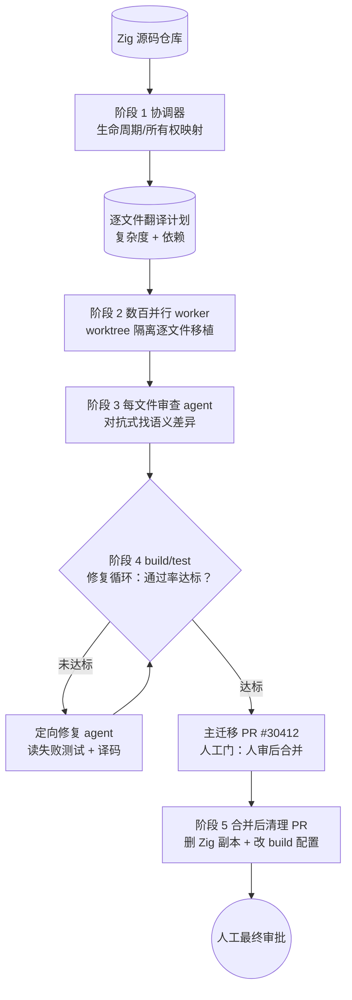

# Bun Zig→Rust 迁移案例

> **来源与免责声明**：以下数字来自 2026 年 5 月 The Register、DEV、Eva Daily、dasroot.net 等多家公开报道（围绕 Bun 作者 Jarred Sumner 合并的 PR [#30412](https://github.com/oven-sh/bun/pull/30412)「Rewrite Bun in Rust」展开），不同来源在行数与天数上有出入。本页把这些数字当作**示例性**而非独立核实的精确值，用来说明大规模迁移如何被工作流结构化——而非作为可复现的基准。动态工作流（Dynamic Workflows）是 Claude Code 的研究预览能力，API 与行为可能演进。

## 摘要

2026 年 5 月，Bun（JavaScript/TypeScript 运行时）把它的 Zig 代码库移植成了 Rust。据公开报道：

- 合并的 PR 为 **#30412**，diff 新增约 **1,009,257 行**、删除约 4,024 行、约 **6,755 个 commit**。
- 移植规模约 **100 万行**（不同来源口径为 ~770k 到 ~1M）的 Zig 源码。
- 用 **Anthropic Claude Code** 完成，耗时约 **6 天 / 一周**。
- 在 **Linux x64 glibc** 上达到约 **99.8% 的现有测试通过**。
- 由一个「**coordinator（协调器）**」读取原 Zig 源码、映射到等价的 Rust 抽象、并管理测试套件迁移以保证功能等价。

这不是「让一个子智能体把整个仓库重写一遍」做出来的。它被拆成多个**阶段**：每个阶段有清晰的输入、可验证的输出、独立的审查，最终交付物是一个**可被人审查的 PR**，而不是一段对话。

> 动机侧的背景（同样来自公开报道）：Sumner 厌倦了 Zig 路线下的内存安全 / 泄漏 / 崩溃问题，且维护自定义 Zig fork 不可持续；同期 Anthropic 收购了 Bun。这些是「为什么做」的语境，本页聚焦「**怎么用工作流做**」。

## 为什么是动态工作流，而不是 Agent Teams

100 万行、数百个文件并行翻译、需要逐文件验证、可恢复、可复用——这正是动态工作流相对 Agent Teams 的优势区：

- 计划是**显式脚本产物**，扇出形状由脚本控制，而不是隐含在某个 lead 的推理里；
- 规模可达**数百 agent**，受 `min(16, 核数-2)` 并发上限与全生命周期 1000 agent 总上限约束；
- runtime **自动 journaling**，可用 `resumeFromRunId` 从中断处恢复（无需手动 checkpoint）；
- 同脚本 + 同 args 100% 缓存命中，便于「先小规模试跑、再放大」。

> 真实 API 速览：原语是**全局函数** `agent()` / `pipeline()` / `parallel()` / `phase()` / `log()` 与全局对象 `budget`、`args`，每个脚本以纯字面量 `export const meta = {...}` 开头。本页用到的扇出与收敛语义，参见[并行扇出-收敛](/patterns/parallel-fanout-gather)。

## 阶段拆解

把这次迁移读成一条**生命周期**：先建立翻译规则（映射），再大规模扇出翻译（移植），翻译一份立刻验证一份（审查），把失败收敛回来修（循环），最后单独开一个清理 PR 收尾。



### 阶段 1：生命周期 / 所有权映射

在写第一行 Rust 之前，协调器先跨整个代码库建立 Zig 的所有权与生命周期语义到 Rust 的映射：

- 识别哪些 Zig 构造有**直接 Rust 等价物**（`defer` → `Drop`、显式 allocator → 所有权/借用、错误联合 → `Result`），哪些需要人工干预；
- 为每个文件产出预期的**翻译复杂度**评级；
- 据此决定阶段 2 的**扇出形状**：哪些文件可以无依赖地并行翻译，哪些必须先翻依赖再翻调用方。

**为什么不可省**：直接跳到翻译会生成「本地能编译、集成就崩」的 Rust。映射阶段把失败面**在写代码之前**暴露出来——这正是[顺序流水线](/patterns/sequential-pipeline)里「不在步骤间传递未经验证的自然语言」原则在迁移场景的体现。

```javascript
export const meta = {
  name: "zig-to-rust-coordinator",
  description: "读取 Zig 源码，产出逐文件的 Zig→Rust 翻译计划（复杂度 + 依赖序），供后续并行移植阶段使用",
  phases: ["所有权映射"],
};

phase("所有权映射");
log("协调器：扫描 Zig 源码树，建立所有权/生命周期映射");

// args 传入要分析的文件清单（不在脚本里调 Date.now()/随机，保证 resume 确定性）
const plan = await agent(
  `分析这批 Zig 文件的所有权与生命周期语义，映射到等价 Rust 抽象。
   对每个文件给出：直接等价 / 需人工干预的构造清单、复杂度评级、依赖的其它文件。
   待分析文件：\n${(args.files || []).join("\n")}`,
  {
    label: "ownership-mapping",
    agentType: "Explore",
    schema: {
      type: "object",
      properties: {
        files: {
          type: "array",
          items: {
            type: "object",
            properties: {
              path: { type: "string" },
              complexity: { enum: ["trivial", "moderate", "manual"] },
              dependsOn: { type: "array", items: { type: "string" } },
              manualConstructs: { type: "array", items: { type: "string" } },
            },
            required: ["path", "complexity", "dependsOn"],
          },
        },
      },
      required: ["files"],
    },
  }
);

log(`映射完成：${plan.files.length} 个文件，其中 ${plan.files.filter(f => f.complexity === "manual").length} 个需人工干预`);
```

### 阶段 2：逐文件行为等价移植（数百并行 worker，worktree 隔离）

worker 子智能体**并行**翻译文件，目标是**行为等价**而非 idiomatic Rust——先正确，再地道。每个 worker：

- 以一个 Zig 文件为输入；
- 产出一个能通过该模块**现有测试**的 Rust 文件；
- 不追求惯用写法，把「重构成地道 Rust」留到后续。

**扇出**：数百个 worker 并行，每个隔离到一个文件，脚本强制并行边界——worker 之间**不共享上下文**。因为它们要**真实改文件**且高度并行，必须用 `isolation: 'worktree'` 让每个 agent 在独立 git worktree 中工作，避免并发写冲突（代价是更贵）。这与 [Workspace 隔离](/patterns/workspace-isolation)模式一脉相承。

这里的关键选择是用 `pipeline` 而非 `parallel`：每个文件**独立**流经「移植 → 审查」两个 stage，**stage 之间没有 barrier**——A 文件已进入审查时 B 文件还在翻译，墙钟等于「最慢的单条链」而非「每阶段最慢之和」。这是[并行扇出-收敛](/patterns/parallel-fanout-gather)里反复强调的默认选择。

```javascript
export const meta = {
  name: "zig-to-rust-port",
  description: "按阶段1的翻译计划，并行逐文件把 Zig 移植为行为等价的 Rust，每文件移植后立刻对抗式审查",
  phases: ["逐文件移植"],
};

phase("逐文件移植");

// 把 manual 复杂度的文件先 log 出来——不静默截断，符合 no-silent-caps 原则
const manualFiles = (args.plan || []).filter(f => f.complexity === "manual");
if (manualFiles.length) {
  log(`以下 ${manualFiles.length} 个文件标记为需人工干预，仍走自动移植但会重点审查：`);
  manualFiles.forEach(f => log(`  - ${f.path}`));
}

// pipeline：每个文件独立流经「移植 → 审查」，stage 间无 barrier
const results = await pipeline(
  args.plan,

  // stage 1：移植（worktree 隔离，真实改文件，并行写不冲突）
  (file) =>
    agent(
      `把 Zig 文件 ${file.path} 移植为行为等价的 Rust。
       目标：通过该模块的现有测试。先正确，不必 idiomatic。
       需特别处理的构造：${(file.manualConstructs || []).join(", ") || "无"}`,
      {
        label: `port:${file.path}`,
        phase: "逐文件移植",            // 显式归组，避免在 pipeline 内争用全局 phase
        isolation: "worktree",          // 独立 worktree，避免并行写冲突
      }
    ),

  // stage 2：对抗式审查（见阶段 3）
  (portResult, file) =>
    agent(
      `你是对抗式审查者，任务是【找问题】而非批准。
       审查 ${file.path} 从 Zig 到 Rust 的移植，对比原 Zig 语义：
       - 内存/错误模型差异（allocator、错误联合 vs Result、panic 边界）
       - 行为等价但脆弱的构造
       移植产物：\n${portResult}`,
      {
        label: `review:${file.path}`,
        phase: "逐文件移植",
        schema: {
          type: "object",
          properties: {
            verdict: { enum: ["pass", "needs-human", "re-port"] },
            issues: { type: "array", items: { type: "string" } },
          },
          required: ["verdict", "issues"],
        },
      }
    )
);

// pipeline 中某 stage 抛错 → 该 item 落为 null，用前过滤
const reviewed = results.filter(Boolean);
log(`移植 + 审查完成：${reviewed.length}/${args.plan.length}，` +
    `其中 ${reviewed.filter(r => r.verdict !== "pass").length} 个待处理`);
```

### 阶段 3：每文件审查 agent（对抗式找问题）

每个文件移植后，一个审查 agent 立刻检查这次翻译（在上面的 `pipeline` 中作为第二个 stage 出现，翻译一份验证一份）：

- 比对 Zig 与 Rust 实现的**语义差异**；
- 标记那些「测试通过但脆弱」的构造（例如依赖未定义行为、错误传播路径被悄悄改变）；
- 产出逐文件审查报告，给出 `pass` / `needs-human` / `re-port` 裁决。

**对抗式取向**：审查 agent 被提示「**找问题，而不是批准**」。这与[生成器-批判者](/patterns/generator-critic)模式同源——把「批判」做成独立角色而非翻译者的自我检查。通过审查的文件继续向前；未通过的被标记为人工审查或重新翻译。

> 进阶做法（见[辩论-裁判](/patterns/debate-judge)）：对高风险文件，可给多个审查者**不同视角**（内存安全 / 错误语义 / 并发）而非 N 个相同的反驳者，减少「审查者共享同一盲区」的系统性风险。

### 阶段 4：build / test 修复循环

一个循环阶段对已移植文件跑 build 与测试套件，把失败**收敛**回工作流：

- build 失败路由到定向修复 agent；
- test 失败路由到能同时检查「失败的测试」与「移植后代码」的 agent；
- 循环持续到通过率达阈值，**或预算耗尽**。

`budget` 是硬上限——`spent()` 达到 `total` 后再调 `agent()` 会抛错，所以循环条件里要主动留出余量。这正是[精化循环](/patterns/refinement-loop)与「loop-until-budget」的真实落地：

```javascript
export const meta = {
  name: "zig-to-rust-fix-loop",
  description: "对已移植文件反复跑 build/test，把失败路由到定向修复 agent，直到通过率达标或预算耗尽",
  phases: ["修复循环"],
};

phase("修复循环");

let round = 0;
let passRate = args.initialPassRate || 0;
const target = args.targetPassRate || 0.998;

// loop-until-count 与 loop-until-budget 复合条件：达标即停，预算见底也停
while (passRate < target && budget.total && budget.remaining() > 50_000) {
  round += 1;
  log(`修复循环第 ${round} 轮，当前通过率 ${(passRate * 100).toFixed(2)}%，剩余预算 ${budget.remaining()}`);

  // 1) 收集本轮的失败（build + test）
  const failures = await agent(
    "对当前分支跑 build 与测试套件（Linux x64 glibc），返回失败清单：每条含 类型(build|test)、文件、摘要",
    {
      label: `collect-failures:r${round}`,
      schema: {
        type: "object",
        properties: {
          passRate: { type: "number" },
          failures: {
            type: "array",
            items: {
              type: "object",
              properties: {
                kind: { enum: ["build", "test"] },
                file: { type: "string" },
                summary: { type: "string" },
              },
              required: ["kind", "file", "summary"],
            },
          },
        },
        required: ["passRate", "failures"],
      },
    }
  );

  passRate = failures.passRate;
  if (!failures.failures.length) break;

  // 2) 并行修复——这里用 parallel 而非 pipeline：要等本轮全部修完再重测（barrier）
  await parallel(
    failures.failures.map((f) => () =>
      agent(
        `修复 ${f.file} 的 ${f.kind} 失败：${f.summary}。
         检查失败的测试与移植后代码，做最小修改使其通过且保持行为等价。`,
        { label: `fix:${f.kind}:${f.file}`, isolation: "worktree" }
      )
    )
  );
}

log(`修复循环结束：第 ${round} 轮，最终通过率 ${(passRate * 100).toFixed(2)}%（Linux x64 glibc）`);
```

**为什么是循环而不是一次性**：没有哪个大规模翻译第一遍就全对。循环阶段把「迭代」做成工作流的**一等组成**，而不是事后手动跟进。注意阶段 4 内部用了 `parallel`（barrier）——因为要等本轮所有失败都修完，再统一重测下一轮；而阶段 2 用 `pipeline`（无 barrier）让文件各自流动。**何时 barrier、何时不 barrier**，是这套编排的核心判断，详见[并行扇出-收敛](/patterns/parallel-fanout-gather)。

### 阶段 5：合并后清理 PR 工作流

主迁移（PR #30412）合并后，一个**独立**的工作流负责收尾：

- 删除已完整移植的 Zig 副本文件；
- 更新 build 配置中的引用；
- **开一个新 PR** 让人审查，而不是直接改 main。

**产出物是 PR**：清理工作流不把变更直接 apply 到 main，而是创建 PR，为最终状态变更**保留一道人工审查门**。可用 `workflow()` 把它作为子步骤内联（只能嵌套一层），与主迁移共享并发上限与计数。

## 工程教训

### 大迁移是阶段，不是一个 prompt

Bun 这次能成，是因为每个阶段都有**明确界定的输入、可验证的输出、独立的审查步骤**。一个「把 Bun 从 Zig 迁到 Rust」的单 prompt 不会产出可审查的结果——它会产出一坨无从下手的 diff。把任务拆成「映射 → 移植 → 审查 → 修复 → 清理」，每一步都成为可观测、可重跑、可恢复的单元。

### 验证是结构性的，不是可选项

审查 agent 与 build/test 循环**不是质量保障的附加项，而是工作流的结构性部分**。没有它们，99.8% 的测试通过率根本达不到——第一遍翻译必然带错。验证被编进脚本拓扑（对抗式审查作为 pipeline 的第二 stage、修复循环作为收敛阶段），而不是放在最后碰运气。

### 产物是 PR，而不是对话

工作流的最终交付物是**分支上的代码**，可被人在合并前审查。对话式界面只是**触发器**（提示里含 `workflow` 关键字、或 ultracode 模式下自动编排），工程交付物是 PR。这一点决定了它能进真实的代码评审流程，而不是停留在聊天记录里。

### 人工门不可省

即便有大规模自动审查，**最终 PR 仍由人审查后才合并**。100 万行无法逐行人审——这恰恰说明：工作流的各验证阶段承担了大部分质量工作，但「合不合」的决定权仍留在人手里。自动化做了能自动化的部分，没有把人的判断移出关键路径。关于把人放进关键路径的系统化设计，见[人在环路](/patterns/human-in-the-loop)。

## 风险与开放问题

| 风险 | 说明 |
|---|---|
| 语言语义差异 | Zig 与 Rust 的内存模型、错误模型不同（allocator vs 所有权、错误联合 vs `Result`、panic 边界）。**测试级行为等价 ≠ 全条件下语义等价**——测试没覆盖到的路径可能行为不一致。 |
| 测试覆盖空洞 | 99.8% 指**既有测试套件**（且限定 Linux x64 glibc）；翻译引入的**新失败模式**可能根本没有对应测试，其它平台（macOS / Windows / musl / ARM）的兼容性需另行验证。 |
| 审查者相关性 | 若所有审查 agent 用相似提示词，会**共享系统性盲区**。用视角分化（内存/错误/并发）的独立审查者，比 N 个同质反驳者更能暴露问题。 |
| 生成代码可维护性 | 「行为等价」的 Rust 未必 idiomatic（可能保留了 Zig 风格的手动内存管理痕迹）。长期可维护性依赖**后续人工重构**，这部分成本不在迁移的 6 天里。 |
| 人审范围的物理上限 | 100 万行的最终 PR **无法逐行人工审查**，质量主要由工作流的验证阶段承担。人审更像是「抽样 + 信任流程」，需要对工作流本身的可信度有信心。 |
| 数字本身的不确定性 | 行数（~770k–1M）、天数（~6 天/一周）在不同公开来源间有出入，本页采用区间表述；把它当作**量级参考**而非精确基准。 |

## 延伸阅读

- [顺序流水线](/patterns/sequential-pipeline) —— 「映射 → 移植 → 审查 → 修复 → 清理」这条阶段化生命周期的模式基础
- [并行扇出-收敛](/patterns/parallel-fanout-gather) —— 阶段 2（pipeline，无 barrier）与阶段 4（parallel，有 barrier）的选择依据，以及扇出/收敛语义
- [Workspace 隔离](/patterns/workspace-isolation) —— `isolation: 'worktree'` 背后的模式
- [生成器-批判者](/patterns/generator-critic)、[辩论-裁判](/patterns/debate-judge) —— 对抗式审查阶段的模式来源
- [精化循环](/patterns/refinement-loop) —— build/test 修复循环的「loop-until-budget」模式
- [人在环路](/patterns/human-in-the-loop) —— 人工门与最终审批的模式来源
