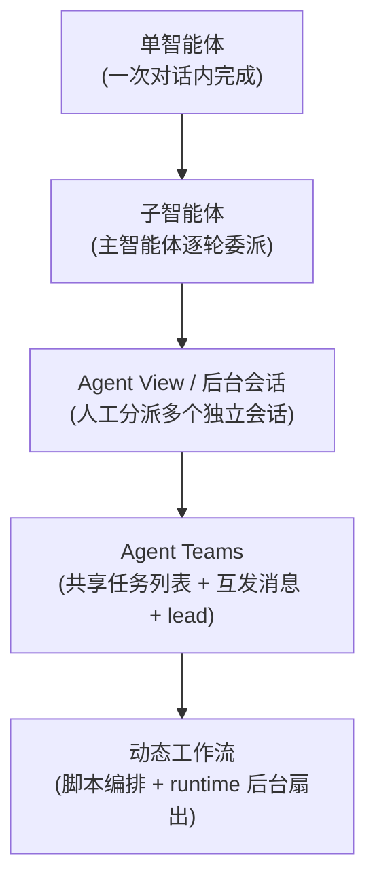

# 动态工作流概览

**动态工作流（Dynamic Workflows）**是 Claude Code 的一项能力（当前处于**研究预览**阶段）：面对一个足够大的任务，Claude 不再自己一轮一轮地干活，而是先写出一段 **JavaScript 编排脚本**，交给 runtime 在后台执行；脚本运行时扇出大量**子智能体**去做实际的读写、命令、Web 与 MCP 工作，再把结果在脚本变量里收敛。

换句话说：**计划被显式地写成了代码**。子智能体是工人，脚本是工头，runtime 是调度器。这与「让很多 LLM 互相聊天」有本质区别——扇出形状、并发上限、中间状态、质量门、收敛逻辑全部由脚本精确控制，而且可以被持久化、恢复、保存、复用。

> 研究预览说明：API 仍可能演进。本页所有签名以 Claude Code 工具的真实规范为准——下文的 `agent()` / `parallel()` / `pipeline()` / `phase()` / `log()` / `budget` / `workflow()` 都是**全局函数**，不是 `ctx.` 上的方法；脚本是**纯 JavaScript**（不是 TypeScript），且**没有 `checkpoint()` 原语**，恢复完全由 runtime 自动 journaling 完成。

## 编排能力光谱

Claude Code 提供的不是单一的多 Agent 形态，而是一条**从轻到重的连续光谱**。从上到下，协调复杂度、并行规模和上下文隔离能力递增，但调试难度和开销也随之上升。**默认从最上面开始，只有当上一级真的不够用时才往下走。**



### 单智能体

能在一轮对话上下文里装下的任务，首选单智能体。**最可靠、开销最低、最易调试**。绝大多数日常编码、问答、单文件改动都属于这一档。不要为了「显得高级」而把它升级成多 Agent——多出来的协调成本几乎总是亏的。

### 子智能体

主智能体从自身派生一个或多个**子会话**，用来隔离副任务的上下文（例如「去读完这 40 个文件再回来告诉我结论」）。主智能体逐轮地通过自己的主推理来协调它们：派任务 → 等结果 → 综合。适合**上下文需求独立、边界清晰**的子任务，能有效保护主上下文不被污染。

### Agent View / 后台会话

从界面上**手动分派**多个彼此独立的 Claude Code 会话，让它们并行干各自的活。你愿意自己来协调结果——它们之间**没有共享任务列表，也没有互发消息**。适合「我有几件互不相干的事，想同时推进」的场景。

### Agent Teams

多个 Claude Code 会话组成一个**团队**：共享一份任务列表（`TaskCreate` / `TaskUpdate`），彼此可以 `SendMessage` 互发消息，并指定一个 **lead** 负责协调、委派和综合。计划隐含在 lead 的推理里，随对话演进。适合**不同 Agent 各有专长、需要互通有无**的复杂任务（参见[监督者 / 管理者](/patterns/supervisor-manager)）。

### 动态工作流

光谱的最重一档。一段脚本承载**计划、并行结构、中间变量、质量检查与收敛逻辑**；子智能体只负责执行实际工作；runtime 在后台跑这段脚本。它把前几档里「隐含在推理中」的东西全部**外化成了可检视、可恢复、可复用的代码产物**。当任务规模达到数十乃至数百个子智能体、需要精确控制扇出形状、或希望事后能改一处重跑全程时，才轮到它出场。

完整工程模式见：[动态工作流 / 代码编排子智能体](/patterns/dynamic-workflow-code-orchestration)。

## 动态工作流 vs Agent Teams

两者都能调动多个子智能体，但**心智模型完全不同**。Agent Teams 像一个**人类团队**——靠对话、消息和共享看板协作；动态工作流像一条**自动化产线**——靠一份脚本精确编排。下表给出选型依据：

| 维度 | Agent Teams | 动态工作流 |
|---|---|---|
| **计划表示** | 隐含在 lead 的推理与对话中 | 显式的脚本产物（一段可读 JS） |
| **中间状态** | 散落在各 agent 的上下文里 | 集中在脚本变量 / runtime 中 |
| **并行** | lead 临场分派任务 | 脚本用 `parallel()` / `pipeline()` 精确控制扇出形状 |
| **恢复** | 无（会话中断即丢失） | `resumeFromRunId` 自动 journaling，改动点之前 100% 缓存命中 |
| **复用** | 仅限本次对话 | 保存到 `.claude/workflows/` 换参数重跑 |
| **规模** | 数个到数十个 agent | 数十到数百个 agent（累计总量，全生命周期总上限 1000） |

需要强调的是，「数十到数百」指的是**全生命周期累计调用的 agent 数**，不是同一时刻在跑的并发数：同一 workflow 的并发 agent 上限被夹在 `min(16, CPU 核数 − 2)`，超出的会排队等待；全生命周期 agent 总数则有 1000 的硬上限兜底。换言之，你可以累计扇出数百个 agent，但任一瞬间最多只有十几个真正在并发执行。

经验法则：

- **要协作、要讨论、专长各异、规模不大** → Agent Teams。
- **要规模、要可复现、要事后能改一处重跑、扇出形状明确** → 动态工作流。

## 触发方式

动态工作流不是凭空启动的，以下任一情况会触发 Claude 编排并运行一个 workflow：

- **提示里显式包含 `workflow` 关键字**——例如「**用一个 workflow 审计所有与鉴权相关的文件**」。这是最直接的触发方式。
- **ultracode 模式开启时**：对每个实质性任务默认编排并运行 workflow（这是一个长期 opt-in 的工作模式）。
- **你直接提要求**：「扇出一批 agent 并行干 / 用子智能体编排这件事」。
- **某个 skill 或 slash 命令的指令要求调用 Workflow**。
- **运行一个已保存的命名 workflow**（见下文「保存与复用」）。

> 纠正一个常见误解：触发靠的是 **ultracode 模式 + `workflow` 关键字**，**不存在 `/effort ultracode` 这个 slash 命令**。如果你在别处看到这种写法，那是不准确的。

## 监控

工作流跑在**后台**：发起时调用返回一个 task id，完成时你会收到一条 `<task-notification>`。运行期间用 **`/workflows`** 命令查看正在运行的工作流与历史。进度视图包含：

- 当前阶段（由脚本里的 `phase()` 划分）
- 活动 agent 数（受并发上限约束，见下）
- 累计 token 总量
- 已耗时
- 各阶段的状态

脚本里穿插的 `log()` 会作为进度叙述显示在进度树上方，方便你实时看清「现在做到哪一步、为什么这么分支」。

需要区分两个容易混淆的数字：**同一 workflow 的并发 agent 上限为 `min(16, CPU 核数 − 2)`，超出的会排队**；而**全生命周期 agent 总数上限为 1000**（一道防失控的硬兜底）。所以进度视图里的「活动 agent 数」最多十几个，但工作流跑完后累计调用的 agent 可达数百。

## 保存与复用

一段写好的工作流可以**保存下来反复使用**，落盘位置有两级：

- **项目级**：`.claude/workflows/`——随仓库走，团队共享，适合「本项目的标准审计 / 迁移流程」。
- **用户级**：`~/.claude/workflows/`——跟着你个人走，适合「我惯用的某套调研编排」。

保存后即可换参数重跑：脚本通过全局 `args` 接收调用时传入的 JSON 值。配合 `resumeFromRunId`，同脚本 + 同 args 可做到 100% 缓存命中，改动点之前的 `agent()` 调用直接复用上次结果——这正是动态工作流相比 Agent Teams 在**可复现性**上的核心优势。

## 最小可运行示例

下面是一个能直接跑的最小工作流：对传入的若干文件并行做安全审计，每个文件流经「审计 → 汇总」两个阶段。注意三个要点——脚本以**纯字面量的 `export const meta` 块**开头；用 `pipeline()` 而非 `parallel()`，让每个文件**独立流过两个阶段**（A 文件审计完立刻进入汇总，无需等 B）；脚本需要的时间戳从 `args` 取（`args.timestamp`），**绝不在脚本里调 `Date.now()`**——后者会破坏 resume 的确定性，导致缓存全部失效。

```js
export const meta = {
  name: "audit-files",
  description: "并行审计一组文件的安全问题，逐文件汇总",
  whenToUse: "需要对多个文件做独立、可复现的安全审计时",
  phases: ["审计", "汇总"],
};

const files = args.files; // 调用时传入：{ "files": [...], "timestamp": "..." }
const ts = args.timestamp; // 审计时间戳必须从 args 传入，不能 Date.now()

phase("审计");
log(`审计于 ${ts} 启动，共 ${files.length} 个文件`);

const results = await pipeline(
  files,

  // stage 1：审计单个文件，结构化返回
  (file) =>
    agent(`审计文件 ${file} 的安全问题，列出每条 finding 的位置与严重级别。`, {
      label: `审计 ${file}`,
      phase: "审计",
      schema: {
        type: "object",
        properties: {
          file: { type: "string" },
          findings: {
            type: "array",
            items: {
              type: "object",
              properties: {
                location: { type: "string" },
                severity: { type: "string" },
                detail: { type: "string" },
              },
              required: ["location", "severity", "detail"],
            },
          },
        },
        required: ["file", "findings"],
      },
    }),

  // stage 2：把该文件的 findings 汇总成一段可读结论
  (audit) =>
    agent(
      `把 ${audit.file} 的以下 ${audit.findings.length} 条 finding 汇总成一段简明结论：\n` +
        JSON.stringify(audit.findings),
      { label: `汇总 ${audit.file}`, phase: "汇总" },
    ),
);

log(`审计完成（启动于 ${ts}），共产出 ${results.filter(Boolean).length} 份结论`);
return results.filter(Boolean);
```

这段脚本里没有出现任何 `ctx.agent` / `ctx.checkpoint`——它们不是真实 API。持久化与恢复由 runtime 自动完成：每次调用都会落盘脚本并返回 `scriptPath` 与 `runId`，下次用 `resumeFromRunId` 重跑时，**最长未改动前缀**的 `agent()` 调用直接命中缓存。把时间戳收进 `args` 而非现取，正是为了让同一组输入每次都跑出同样的前缀、缓存才能稳定命中。

想深入理解 `pipeline()`（流式、无阶段 barrier）和 `parallel()`（barrier、收齐全部结果）的区别，见[并行 vs 流水线](/workflows/parallel-vs-pipeline)。

## 延伸阅读

工作流板块的其余四篇：

- [编排原语](/workflows/orchestration-primitives) —— `agent()`、`parallel()`、`pipeline()`、`phase()`、`log()`、`budget`、`workflow()` 的真实签名与语义。
- [并行 vs 流水线](/workflows/parallel-vs-pipeline) —— barrier 并发与流式并发的语义差异，以及何时用哪个。
- [治理、权限与成本](/workflows/governance-permission-cost) —— 审批、权限白名单、token 预算硬上限、恢复与回滚。
- [Bun Zig→Rust 迁移案例](/workflows/bun-zig-to-rust-case) —— 一次大规模迁移的工程拆解。

相关工程模式：

- [动态工作流 / 代码编排子智能体](/patterns/dynamic-workflow-code-orchestration) —— 本能力对应的完整模式页。
- [并行扇出 / 汇聚](/patterns/parallel-fanout-gather) —— 扇出—收敛的经典信息流模式。
- [顺序流水线](/patterns/sequential-pipeline) —— `pipeline()` 背后的多阶段信息流思想。
- [监督者 / 管理者](/patterns/supervisor-manager) —— Agent Teams 中 lead 角色的模式基础。
