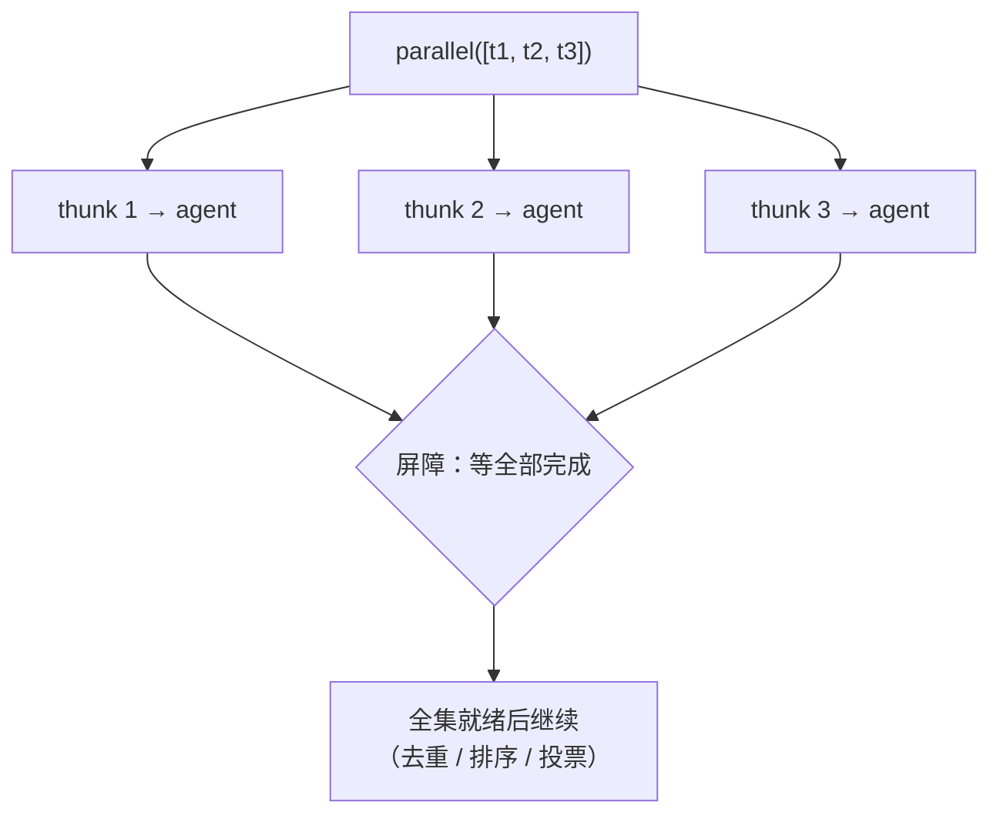
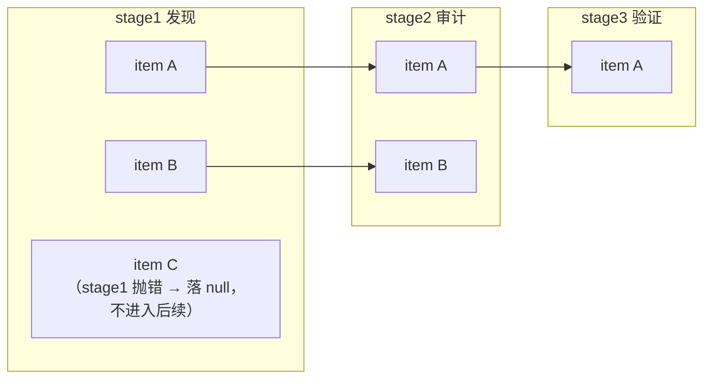
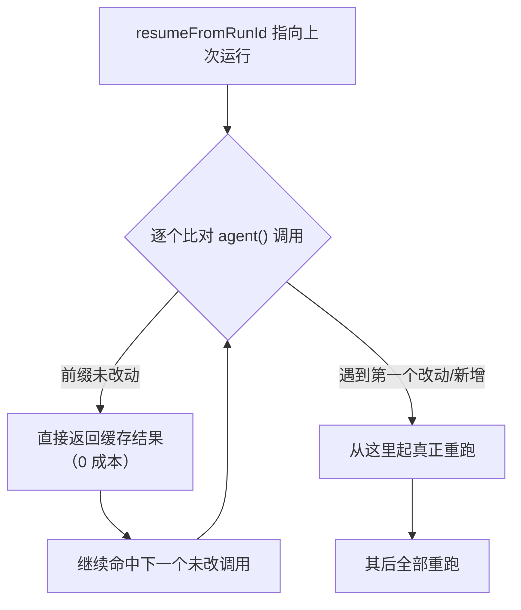

# 编排原语详解

> 研究预览说明：Claude Code 的「动态工作流（Dynamic Workflow）」仍处于研究预览阶段，下文 API 的签名可能随版本演进。但本页所有原语、签名与语义均以真实工具规范为准，**不是伪代码**。如果你读过上游 multi-agent.wiki，请注意：上游把这套 API 臆测成了 `ctx.agent()` / `ctx.parallel()` / `ctx.checkpoint()` 这种带 `ctx.` 前缀的「方法」，还杜撰了 `/effort ultracode` 这种命令——**这些都是错的**，本页会逐条纠正。

一份动态工作流脚本，本质是一段**纯 JavaScript**：你用一小组全局函数把编排逻辑写成显式代码，runtime 负责派生子智能体、控制并发、记录日志、自动持久化以支持恢复。每个原语对应一个明确的并发或质量控制关注点。本页逐个讲清它们的工程语义、适用时机、风险与真实代码示例。

**类别**：编排能力光谱

如果你还不清楚动态工作流在整个编排谱系中的位置，先读 [Wiki 概览](/) 与 [模式概览](/patterns)。

## 脚本骨架：先有 meta，再有原语

任何动态工作流脚本都必须以 `export const meta = {...}` 开头，且 `meta` 必须是**纯字面量**——里面不能出现变量引用、函数调用、展开运算符或模板字符串插值。runtime 在真正执行脚本体之前会静态读取这个块来登记工作流元信息。

```js
export const meta = {
  name: "audit-codebase",
  description: "对一组源文件做安全审计，并对每条发现做对抗式验证",
  whenToUse: "当用户要求对仓库做深度审计、且发现质量值得额外验证成本时",
  phases: ["发现", "审计", "验证", "综合"],
};

// 脚本体在 async 上下文中运行，可直接 await
phase("发现");
log("开始扫描入口文件");
const files = args.files;
// ... 后续用 agent / parallel / pipeline 编排
```

几条硬约束，违反会直接报错或破坏恢复：

- **是 JavaScript，不是 TypeScript**：不能写类型注解（`: string[]`）、`interface`、泛型。
- `meta` 中 `name`、`description` 必填；`whenToUse`、`phases`（每项对应一次 `phase()`，标题需精确匹配）、`model` 可选。
- 脚本体本身就在 async 上下文里，直接 `await`，不需要包一层 `async function main()`。
- **禁止 `Date.now()` / `Math.random()` / 无参 `new Date()`**——它们会破坏恢复缓存的确定性，runtime 会直接抛错。需要时间戳就通过 `args` 传入，需要随机性就按 `index` 派生。详见下文「resume 与确定性」。

下面进入正题，逐个原语展开。

## `agent(prompt, opts?)` — 派生一个子智能体

最基础的原语。派生一个独立的子智能体（[子智能体](/reference/glossary)）会话去完成一段任务，返回它的产出。

```js
// 无 schema：返回子智能体的最终文本（string）
const summary = await agent("用三句话总结 src/auth.ts 的鉴权流程");

// 带 schema：返回已校验的结构化对象
const finding = await agent("审计 src/auth.ts，找出鉴权相关漏洞", {
  label: "审计 auth.ts",
  schema: {
    type: "object",
    properties: {
      file: { type: "string" },
      severity: { type: "string", enum: ["low", "medium", "high", "critical"] },
      issues: { type: "array", items: { type: "string" } },
    },
    required: ["file", "severity", "issues"],
  },
});
```

**工程语义**

- 每次 `agent()` 调用都是一个**独立的 Claude 会话**，拥有自己的上下文窗口；它能读写文件、跑命令、访问 Web、调用 MCP——取决于继承自父会话的工具 allowlist。
- **不带 `schema`** → 返回子智能体的最终文本（`string`）。
- **带 `schema`**（一段 JSON Schema）→ 子智能体被强制调用 `StructuredOutput` 工具，返回**已经校验过的对象**。如果产出不符合 schema，runtime 会自动重试，**你不需要手动 `JSON.parse` 或写校验逻辑**。
- 如果用户在运行过程中**跳过**了某个 agent，该调用返回 `null`——所以扇出后常见 `.filter(Boolean)`。

`opts` 支持这些键：

| 选项 | 作用 |
|------|------|
| `label` | 在进度树上显示的名字，便于监控时辨认 |
| `phase` | 把该 agent 显式归入某个进度组。在 `pipeline` / `parallel` 内部尤其有用——避免多个并发 agent 争用全局 phase 状态 |
| `schema` | JSON Schema；提供后强制结构化输出并自动校验重试 |
| `model` | 覆盖该 agent 使用的模型。默认**继承主循环模型**，不确定就别加 |
| `isolation: 'worktree'` | 让该 agent 在独立的 git worktree 中改文件，避免并行写冲突；代价较高，仅在真正并行修改同一仓库时用。参见 [工作空间隔离](/patterns/workspace-isolation) |
| `agentType` | 指定自定义子智能体类型，例如 `'Explore'`（只读探索型） |

**何时用**：任何需要工具访问、会消耗大量上下文、或应当与同辈 worker 相互隔离的工作单元。

**风险**：

- 单次 `agent()` 的产出质量取决于 prompt 与 schema 的设计——schema 太松会拿到杂乱结构，太紧会频繁触发重试推高成本。
- 不带 schema 的文本返回值在多阶段流转中容易把上游幻觉当事实传下去；阶段间最好用 schema 约束，参见 [顺序流水线](/patterns/sequential-pipeline)的「不要在步骤间传递原始自然语言」。
- `model` 滥用会让成本不可控；除非有明确理由（比如让验证者用更强模型），否则保持默认继承。

## `parallel(thunks)` — 屏障式扇出

把一批工作**同时**发出去，并在屏障（barrier）处等待**全部**完成才返回。

```js
// 注意：传入的是「返回 Promise 的函数（thunk）」数组，不是 Promise 数组
const findings = await parallel(
  files.map((file, i) => () =>
    agent(`审计 ${file}`, { phase: "审计", label: `审计 ${file}`, schema: FINDING_SCHEMA })
  )
);

// 失败的 thunk 会在结果数组里落为 null，用前先过滤
const valid = findings.filter(Boolean);
log(`收到 ${valid.length} / ${files.length} 条有效发现`);
```

**工程语义**

- 入参是 **`Array<() => Promise>`**——即「返回 Promise 的函数（thunk）」数组，**不是已经启动的 Promise 数组**。runtime 自己决定何时调用这些 thunk（受并发上限约束）。这是和上游臆测最容易混淆的一处。
- **是屏障语义**：下一行代码要等批次里每个 thunk 都完成后才执行。
- 某个 thunk 抛错（或其内部 agent 出错）→ 在结果数组对应位置落为 `null`，**`parallel` 调用本身不会 reject**。所以用结果前几乎总要 `.filter(Boolean)`。
- 墙钟时间由**最慢的那个 worker**决定。

**何时用**：仅当你确实需要把**全集结果一起拿到**才能进行下一步时——典型场景是跨全集去重、全局排序、投票、早退判断。如果下一步并不需要全集，用 `pipeline` 通常更快。详见 [并行扇出/收敛](/patterns/parallel-fanout-gather)，那里展开了 `parallel` 与 `pipeline` 的取舍。

**风险**：

- 一个慢或失败的 worker 会拖住整个批次（屏障的固有代价）。把 worker 设计成相互独立、有界、不依赖彼此输出。
- 忘记 `.filter(Boolean)` 会让后续逻辑在 `null` 上崩溃——这是最常见的 bug。
- 如果你做了截断（比如只取前 N 条），必须 `log()` 出被丢弃的部分，不要静默裁剪。



## `pipeline(items, stage1, stage2, ...)` — 流式扇出

让每个 item **独立**地流经一串 stage，**stage 之间没有屏障**。多阶段工作的**默认选择**。

```js
// 每个文件独立走完 发现 → 审计 → 验证 三个阶段
const results = await pipeline(
  files,
  // stage1：第一个回调收到的 prev 就是原始 item
  (file, _item, index) =>
    agent(`扫描 ${file} 的可疑入口`, { phase: "发现", schema: ENTRY_SCHEMA }),
  // stage2：prev 是上一阶段的产出
  (entries, file, index) =>
    agent(`基于线索审计 ${file}`, { phase: "审计", schema: FINDING_SCHEMA }),
  // stage3
  (finding, file, index) =>
    agent(`对抗式验证这条发现：${JSON.stringify(finding)}`, {
      phase: "验证",
      schema: VERDICT_SCHEMA,
    })
);

const confirmed = results.filter(r => r && r.verdict === "confirmed");
```

**工程语义**

- 每个 item 在它**自己的上一阶段完成的那一刻**就进入下一阶段——item A 可能已经在 stage3，而 item B 还在 stage1。
- 因此墙钟时间 ≈ **最慢的那一条单链**，而不是「每个阶段最慢者之和」。这正是它通常比「多次 `parallel` 串起来」更快的原因。
- 每个 stage 回调收到 `(prevResult, originalItem, index)` 三个参数：第一个 stage 的 `prevResult` 就是原始 item 本身；后续 stage 的 `prevResult` 是前一阶段的返回值。`originalItem` 始终是该条目最初的输入，`index` 是它在 `items` 中的下标。
- 某个 stage 抛错 → 该 item 落为 `null` 并**跳过其余 stage**（不会污染别的 item）。

**何时用**：item 之间相互独立、且任务能从「早出部分结果」中获益时——大批文件流、单条延迟不均、需要边算边产出报告。只要不是「必须等全集才能动」，多阶段就优先选它。`parallel` 与 `pipeline` 的对比分析见 [并行扇出/收敛](/patterns/parallel-fanout-gather)。

**风险**：

- 流式意味着部分结果会陆续到达，综合阶段要能处理「逐步累积」而非「一次拿全」。
- 跨 item 的全局操作（去重、排序）不适合放在 pipeline 内部——那需要全集，应改用 `parallel`。一个经典的组合是：`pipeline` 里先各自审计，最后再 `parallel` 收齐全部发现做跨全集去重。
- 阶段回调里别忘了 `index` 可用——需要确定性的「伪随机」就用它派生，不要用 `Math.random()`（见下文）。



> 上面的图刻意画成「错位」的：A 已经到 stage3，B 还在 stage2，C 在 stage1 就失败被跳过（所以它没有任何出边，止步于 S1）——这正是流式扇出与屏障扇出的本质区别。

## `phase(title)` 与 `log(message)` — 进度叙事

这两个原语不改变执行结果，只塑造**可观测性**。监控视图（`/workflows`）会据此呈现当前阶段、活动 agent 数、token 总量、耗时。

```js
phase("综合");           // 开启新阶段；其后的 agent() 默认归入该阶段进度组
log(`已确认 ${confirmed.length} 条发现，开始撰写报告`);
const report = await agent("把这些发现整理成一份审计报告：" + JSON.stringify(confirmed));
```

**工程语义**

- `phase(title)`：开启一个新阶段，**之后**派生的 `agent()` 默认归入这个阶段的进度组。`title` 应与 `meta.phases` 中的条目精确匹配。
- `log(message)`：在进度树上方输出一行叙述，用于交代「现在在干什么」「丢弃了哪些东西」。

**何时用**：

- 任务有清晰的多阶段结构时，用 `phase()` 给监控者一张地图。
- 凡是做了**截断 / 采样 / top-N** 等会丢信息的操作，都用 `log()` 把被丢弃的部分讲出来——「no silent caps（不静默裁剪）」是这套工具的明确约定。

**风险**：在 `parallel` / `pipeline` **内部**调用 `phase()` 会争用全局阶段状态（多个并发 agent 同时改阶段，进度显示会错乱）。并发体内部要分组，应改用 `agent(..., { phase: "审计" })` 的 `phase` 选项，而不是裸调 `phase()`。

## `budget` — token 预算与硬上限

`budget` 是一个对象，反映本轮工作流的 token 目标（用户用「+500k」式指令设定）。

```js
// budget: { total: number|null, spent(): number, remaining(): number }
log(`预算 total=${budget.total}, 已花 ${budget.spent()}, 剩 ${budget.remaining()}`);

// 典型用法：预算驱动的动态循环
const bugs = [];
while (budget.total && budget.remaining() > 50_000) {
  const batch = await parallel(
    seeds.map((s, i) => () => agent(`从线索 ${i} 出发再找一个不同的 bug`, { schema: BUG_SCHEMA }))
  );
  bugs.push(...batch.filter(Boolean));
  if (batch.every(b => !b)) break; // 收敛：这一轮没新发现就停
}
log(`预算耗尽或收敛，共找到 ${bugs.length} 个 bug`);
```

**工程语义**

- `total`：本轮 token 目标，`null` 表示用户未设。
- `spent()` / `remaining()`：当前已花 / 剩余 token（是函数调用，不是属性）。
- **是硬上限**：`spent()` 达到 `total` 后，再调 `agent()` 会**抛错**。所以不能依赖「超了就温和降级」，必须主动留出余量再发下一批。

**何时用**：任何会循环或扇出规模不定的工作流。把预算守卫（`budget.remaining() > 阈值`）和**逻辑收敛检查**（比如「这一轮没有新发现」）**同时**写进循环条件——光有预算守卫没有收敛检查，会一直烧到上限才停；光有收敛检查没有预算守卫，则可能失控。

**风险**：

- 阈值留得太小（比如只留 10k），最后一批 agent 可能因还没花完就触顶而抛错；按单个 agent 的典型开销留足余量。
- 别把 `budget` 当成进度条精确控制——它是兜底护栏，不是调度器。规模相关的硬上限还有：单工作流并发 agent 上限 = `min(16, 核数 - 2)`，单工作流全生命周期 agent 总数上限 **1000**。

## `workflow(name, args?)` — 内联子工作流

把另一个工作流当作一个步骤内联运行，与父工作流**共享**并发上限、agent 计数与预算。

```js
phase("子流程");
// 复用一个已命名的工作流（保存在 .claude/workflows/ 或 ~/.claude/workflows/）
const triage = await workflow("triage-findings", { findings: confirmed });
log(`子工作流分级出 ${triage.high.length} 条高危项`);
```

**工程语义**

- 子工作流的 agent 也计入父工作流的并发上限、总数上限（1000）与预算——它不是「另开一个独立预算」。
- **只能嵌套一层**：子工作流内部不能再调 `workflow()` 起孙工作流。

**何时用**：你已经有一段被反复复用的编排逻辑（保存在 `.claude/workflows/` 项目级或 `~/.claude/workflows/` 用户级），想在更大的流程里把它当一个黑盒步骤组合进来。

**风险**：嵌套层数被限制为一层是有意为之——它防止「编排套编排」让规模和成本失控。如果你发现需要两层以上，通常意味着该把逻辑摊平成单层脚本，或拆成多个独立工作流串行触发。

## `args` — 工作流入参

`args` 是触发工作流时传入的入参，原样可读；未传则为 `undefined`。

```js
export const meta = { name: "audit", description: "审计指定文件集" };

const files = args.files;                 // 数组要传真正的 JSON 值
const ts = args.timestamp;                // 需要时间戳就从外面传进来
const sampleSeed = args.seed ?? 0;        // 需要随机性时，用确定的 seed 派生
```

**工程语义**

- 传数组 / 对象时要传**真正的 JSON 值**，而不是字符串化的 JSON。
- `args` 是把外部世界（包括「当前时间」「随机种子」这类非确定输入）注入脚本的**唯一正确通道**——因为脚本体内部禁止 `Date.now()` / `Math.random()`。

## resume 与确定性：为什么禁用时间和随机

这是动态工作流最容易被误解的部分，也是上游臆测错得最离谱的地方。

**真相**：没有 `checkpoint()` 这个原语。每次工作流调用，runtime 都会**自动**把脚本持久化，并返回 `scriptPath` 和 `runId`。恢复时你这样调用：

```js
// 恢复一次中断的运行
Workflow({ scriptPath: "/path/to/saved/script.js", resumeFromRunId: "run_abc123" });
```

恢复的机制是**最长未改前缀缓存**：runtime 对比当前脚本与 `resumeFromRunId` 对应的那次运行，脚本中**从头开始、最长一段未改动的 `agent()` 调用前缀**直接返回上次的缓存结果；**第一个被改动或新增的调用，以及它之后的所有调用**，才真正重跑。同脚本 + 同 `args` → 100% 缓存命中。

这就解释了为什么 `Date.now()` / `Math.random()` / 无参 `new Date()` 被**硬性禁止**：

- 如果脚本里某个 agent 的 prompt 依赖 `Date.now()`，那么每次运行这段 prompt 的输入都不一样，runtime 无法判断「这次调用和上次是否等价」，最长未改前缀的匹配就被打断——**缓存全部失效，恢复退化成从头重跑**。
- 同理，`Math.random()` 让每次扇出的形状都不同，缓存无从命中。
- 正确做法：需要时间戳就通过 `args.timestamp` 传入（外部一次性确定）；需要「随机」就按 `index` 派生（`seed + index` 之类），让同一次输入永远产出同一序列。

还有一条与恢复相关的成本细节：Anthropic 的提示缓存 TTL 是 **5 分钟**。如果你的恢复跨过了 5 分钟，被缓存的上下文会以未缓存方式重新读入——更慢更贵。这不影响正确性，但影响你「中断后多久回来恢复」的经济性。



> **不要做的事**：在脚本里写 `const now = Date.now()` 或 `const r = Math.random()`。runtime 会直接抛错；即便不抛错，这也会让 `resumeFromRunId` 的缓存彻底失效。

## 与上游臆测的对照表

如果你对照过上游 multi-agent.wiki，下表帮你把错误的「记忆」纠正过来：

| 上游臆测（错误） | 真实 API（正确） |
|------------------|------------------|
| `ctx.agent(task, input)` | 全局函数 `agent(prompt, opts?)`，无 `ctx.` 前缀 |
| `ctx.parallel(promises)` | `parallel(thunks)`，传**返回 Promise 的函数**数组，不是 Promise 数组 |
| `ctx.pipeline(items, stages)` 用数组传 stage | `pipeline(items, stage1, stage2, ...)`，stage 是可变参数；回调收 `(prev, item, index)` |
| `ctx.checkpoint(state)` 手动检查点 | **不存在**。持久化是 runtime 自动 journaling，恢复用 `resumeFromRunId` |
| `ctx.budget.remaining`（属性、0~1 比例） | `budget.remaining()`（函数、返回剩余 token 数）；另有 `budget.total` / `budget.spent()` |
| `/effort ultracode` 命令 | 不存在该 slash 命令。是 **ultracode 模式** + 提示中包含 `workflow` 关键字 |
| 随手用 `Date.now()` / `Math.random()` | **禁用**，会抛错并破坏恢复；时间走 `args`，随机走 `index` |

## 触发与监控（速览）

- **触发**：提示里显式包含 `workflow` 关键字；或在 ultracode 模式下对每个实质任务默认编排运行；或用户直接要求「跑个 workflow / 扇出 agent / 用子智能体编排」；或运行一个已保存的命名工作流。
- **监控**：`/workflows` 查看运行中的工作流与历史，进度视图含当前阶段、活动 agent 数、token 总量、耗时与阶段级状态。工作流在后台运行，调用返回 task id，完成时收到通知。

## 实现检查清单

- [ ] 脚本以**纯字面量** `export const meta = {...}` 开头，`name` / `description` 齐全。
- [ ] 脚本是纯 JavaScript，无类型注解 / interface / 泛型。
- [ ] 全程**未出现** `Date.now()` / `Math.random()` / 无参 `new Date()`；时间走 `args`，随机走 `index`。
- [ ] `parallel` 传的是 thunk 数组（`() => agent(...)`），且结果用前 `.filter(Boolean)`。
- [ ] 多阶段优先用 `pipeline`；仅当下一步需要全集时才用 `parallel`。
- [ ] 并发体内部用 `agent(..., { phase })` 分组，而非裸调 `phase()`。
- [ ] 循环同时具备预算守卫（`budget.remaining()`）与逻辑收敛检查。
- [ ] 做了任何截断 / 采样都用 `log()` 显式说明，不静默裁剪。
- [ ] 需要修改同一仓库的并行 agent 用 `isolation: 'worktree'`。

## 相关阅读

- [Wiki 概览](/) 与 [模式概览](/patterns) — 这套原语在整个编排谱系中的整体心智模型
- [并行扇出/收敛](/patterns/parallel-fanout-gather) — `parallel` 与 `pipeline` 的取舍
- [顺序流水线](/patterns/sequential-pipeline) — 多阶段串联与「不要在步骤间传递原始自然语言」
- [生成器-评论者](/patterns/generator-critic) 与 [精炼循环](/patterns/refinement-loop) — 对抗式验证与预算驱动循环的模式来源
- [工作空间隔离](/patterns/workspace-isolation) — `isolation: 'worktree'` 的展开
- [术语表](/reference/glossary) 与 [参考资料](/reference/references)
