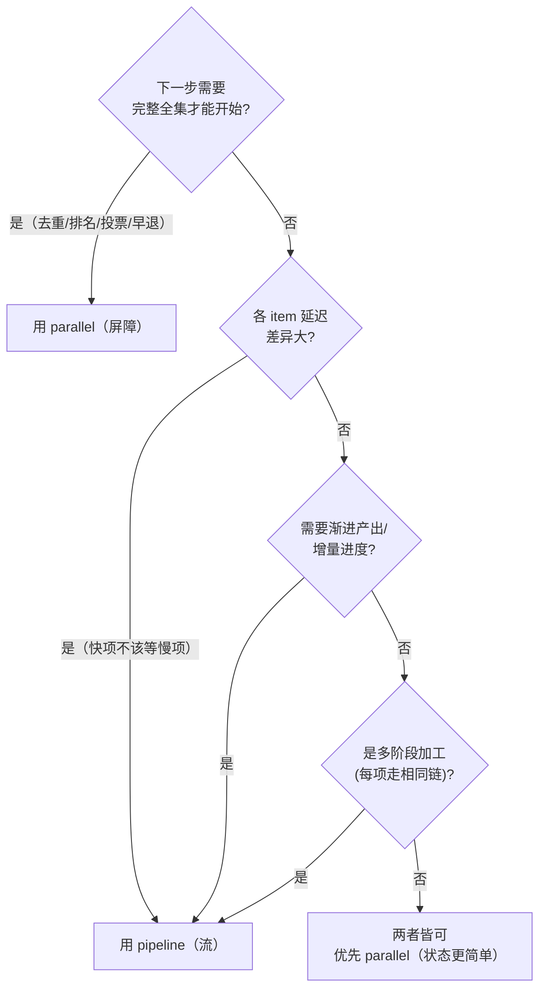

# 并行屏障 vs 流水线

`parallel` 与 `pipeline` 不是同一件事的两个名字。它们的并发模型在根本上不同：`parallel` 是一道**屏障（barrier）**——整批一起开始、等最后一个完成才返回；`pipeline` 是一条**流（stream）**——每个 item 独立穿过所有 stage，完成一个 stage 立刻进入下一个，彼此之间没有等待点。选错原语，要么白白浪费墙钟时间，要么把简单的事写复杂。

本页面用[动态工作流](/patterns/dynamic-workflow-code-orchestration)的真实 API 说明二者的区别、各自的代码形态，以及如何在实践中选择与混用。所有原语都是**全局函数**（`agent()` / `parallel()` / `pipeline()`），不是 `ctx.` 上的方法，恢复依赖 runtime 自动 journaling，脚本里没有 `checkpoint()` 这种原语。

> 研究预览阶段，API 签名可能演进；语义以当前工具规范为准。

## 一句话区分

- **`parallel(thunks)`**：把一组「无参函数（thunk）」并发跑起来，**全部完成**后一次性返回结果数组——这就是 barrier。墙钟 ≈ 最慢的那一个 thunk。
- **`pipeline(items, stage1, stage2, ...)`**：让每个 item **独立**流经所有 stage，stage 之间**没有 barrier**——item A 可能已经在 stage3，而 item B 还在 stage1。墙钟 ≈ 最慢的那**一条单链**（而非「每个阶段最慢者之和」）。

## 对比

| 维度 | Parallel（屏障 / barrier） | Pipeline（流 / stream） |
|---|---|---|
| 调度 | 一批 thunk 同时启动 | 每个 item 独立流过各 stage，互不等待 |
| 阻塞 | 下一步要等**整批**完成才能开始 | 下一 stage 按**单个 item** 触发，不按批 |
| 适用 | 全局比较、去重、投票、全局排名、早退 | 大量 item、各 item 延迟差异大、需渐进产出 |
| 风险 | 一个慢/重试的 thunk 拖累整批墙钟 | 部分状态更难推理（item 可能停在中途某 stage） |
| trace 粒度 | 批级事件（扇出 / 汇聚） | item 级 + stage 级事件，进度更细 |
| 部分结果 | barrier 解除前不可见 | 随每个 item 跑完整条链而渐进可见 |
| 墙钟 | ≈ 最慢 thunk | ≈ 最慢单链（不是各阶段最慢之和） |
| 失败处理 | 出错 thunk 在结果数组里落为 `null` | 某 stage 抛错 → 该 item 落为 `null` 并跳过其余 stage |
| 返回形态 | `Promise<any[]>`（与输入同序） | `Promise<any[]>`（与 items 同序） |

两者都返回**数组**、都把失败项落为 `null`，所以两者的结果用前都要先 `.filter(Boolean)`。这一点很容易忽略：`parallel`/`pipeline` 本身不会 reject，错误是以 `null` 的形式「软」返回的。

## Parallel：屏障语义

把一组 thunk 交给 `parallel`，它们并发执行，**等全部完成**才返回——这就是 barrier。**注意传入的是「函数数组」而不是「Promise 数组」**：每个元素是 `() => agent(...)` 这样的 thunk，由 runtime 决定何时启动、受并发上限调度。

```js
export const meta = {
  name: "audit-files-parallel",
  description: "并行审计一批文件，收齐全部结果后再综合",
};

// 屏障：每个元素是 thunk —— () => agent(...)，不是直接 agent(...)
const audits = await parallel(
  files.map((file) => () =>
    agent(`审计文件 ${file} 的安全问题，列出 findings`, {
      label: `audit:${file}`,
      schema: {
        type: "object",
        properties: {
          file: { type: "string" },
          findings: { type: "array", items: { type: "string" } },
        },
        required: ["file", "findings"],
      },
    })
  )
);

// 走到这一行时，最后一个文件也已经审计完——此刻才拿得到完整全集
const report = await agent("基于以下全部审计结果生成综合报告", {
  label: "synthesize",
  // 出错的文件会是 null，综合前先过滤
  schema: { type: "object", properties: { summary: { type: "string" } } },
});
```

**什么时候用 parallel：**

- 下一步必须拿到**完整全集**才能干活：全局去重、跨文件交叉比较、全局排名、投票裁决、N 选一的 judge panel。
- 各分支延迟大致均匀，barrier 等待的代价可以接受。
- 你需要「先收齐、再统一处理」的清晰心智模型。

**典型坑：** 一个慢分支（或触发重试的分支）会把整批墙钟拖到它的长度。给每个 agent 划清最小职责、必要时拆小，别让一个超长任务卡住屏障。如果其实并不需要全集，那 parallel 就用错了——见下。

## Pipeline：流式语义

`pipeline` 的签名是**变参**的：第一个参数是 items 数组，之后跟**任意多个 stage 回调**（不是把 stage 装进一个数组）。每个 item 独立穿过 `stage1 → stage2 → ...`，**stage 之间没有 barrier**——某个 item 一跑完当前 stage 就立刻进入下一个，不等别的 item。最终返回一个与 items 同序的数组。

每个 stage 回调收到 `(prevResult, originalItem, index)`：第一个 stage 的 `prevResult` 就是 item 本身，之后每个 stage 的 `prevResult` 是上一 stage 的返回值。

```js
export const meta = {
  name: "audit-files-pipeline",
  description: "每个文件独立流过 发现→审计→验证 三阶段，互不等待",
};

// 变参 stages：items 之后跟若干 stage 回调，而不是 [stage1, stage2, stage3]
const verified = await pipeline(
  files,
  // stage1：prevResult === file 本身
  (file) =>
    agent(`扫描 ${file}，定位可疑代码段`, {
      label: `discover:${file}`,
      phase: "audit", // 在 pipeline 内显式归组，避免争用全局 phase 状态
      schema: { type: "object", properties: { spans: { type: "array", items: { type: "string" } } }, required: ["spans"] },
    }),
  // stage2：prevResult === stage1 的返回
  (discovered, file) =>
    agent(`对 ${file} 的可疑段做深入审计`, {
      label: `audit:${file}`,
      phase: "audit",
      schema: { type: "object", properties: { file: { type: "string" }, findings: { type: "array", items: { type: "string" } } }, required: ["file", "findings"] },
    }),
  // stage3：prevResult === stage2 的返回
  (audited) =>
    agent(`复核以下 findings 是否真实成立，剔除误报`, {
      label: "verify",
      phase: "audit",
      schema: { type: "object", properties: { file: { type: "string" }, confirmed: { type: "array", items: { type: "string" } } }, required: ["file", "confirmed"] },
    })
);

// verified 与 files 同序；出错或被跳过的 item 是 null
const confirmed = verified.filter(Boolean);
```

关键点：**墙钟 ≈ 最慢的那条单链**。假设有 3 个 stage、20 个文件，其中一个文件 3 个 stage 都很慢，它的总耗时不会拖累其余 19 个文件——快文件早早跑完整条链产出结果，慢文件慢慢走，二者并行推进。这正是多阶段工作的**默认选择**。

**什么时候用 pipeline：**

- 各 item 在 stage 间彼此**独立**，不需要互相参照。
- 各 item 延迟不均，你不希望快的 item 干等慢的 item。
- item 数量大，希望**渐进产出**、增量观察进度。
- 你想要 item 级 + stage 级的细粒度 trace。

**典型坑：** 流式带来更复杂的部分状态——某个 item 在中途 stage 抛错会落为 `null` 并跳过其后 stage，最终数组里就会混入空洞。把结果聚合逻辑写成幂等的，并且**永远先 `.filter(Boolean)`**。另外，如果你做了 top-N、采样之类的截断，要用 `log()` 把被丢弃的部分显式记录出来，不要静默截断。

## 如何选择



判据可以浓缩成两条：

- **「下一步要不要全集？」要 → parallel。** 去重、全局排名、投票裁决、N 选一这类操作天然需要 barrier 先把全集收齐。
- **「是不是每个 item 各走一条相同的多阶段链、且彼此独立？」是 → pipeline。** 这是 pipeline 的主场，墙钟省在「最慢单链」而非「各阶段最慢之和」。

两者都不强需时，优先 `parallel`：屏障后的状态更容易推理。

## 混用：先 pipeline 产出，再 parallel 收口

复杂工作流常常**两者都用**。最经典的形态是：先 `pipeline` 让每个 item 快速跑完自己的加工链、渐进产出 per-item 结果；再 `parallel` 在**累积全集**上做需要 barrier 的全局操作（去重 / 交叉验证）；最后综合。

注意：`pipeline` 返回的就是数组，**直接拿来用**，不需要也不该写 `for await` 去迭代它（上游把 pipeline 误写成「stages 数组 + `for await` 流式迭代」是错的——真实 `pipeline` 是变参 stages、一次性返回数组）。

```js
export const meta = {
  name: "audit-then-cross-check",
  description: "先 pipeline 逐文件产出 findings，再 parallel 全集去重/交叉验证，最后综合",
  phases: [
    { title: "逐文件审计" },
    { title: "全局交叉验证" },
    { title: "综合" },
  ],
};

// ── 阶段 1：pipeline 逐项产出（墙钟 ≈ 最慢单链）──
phase("逐文件审计");
const perFile = await pipeline(
  files,
  (file) =>
    agent(`扫描并审计 ${file}`, {
      label: `audit:${file}`,
      phase: "逐文件审计",
      schema: {
        type: "object",
        properties: {
          file: { type: "string" },
          findings: { type: "array", items: { type: "string" } },
        },
        required: ["file", "findings"],
      },
    })
);

// pipeline 直接返回数组——展开成扁平的 finding 全集（先过滤 null）
const allFindings = perFile
  .filter(Boolean)
  .flatMap((r) => r.findings.map((text) => ({ file: r.file, text })));
log(`收集到 ${allFindings.length} 条 finding，进入全局交叉验证`);

// ── 阶段 2：parallel 屏障，跨全集交叉验证（需要全集 → 必须 barrier）──
phase("全局交叉验证");
const checked = await parallel(
  allFindings.map((f) => () =>
    agent(`判断这条 finding 是否成立，并与其余 finding 交叉比对、标记重复`, {
      label: `cross-check:${f.file}`,
      phase: "全局交叉验证",
      schema: {
        type: "object",
        properties: {
          file: { type: "string" },
          text: { type: "string" },
          supported: { type: "boolean" },
          duplicateOf: { type: ["string", "null"] },
        },
        required: ["file", "text", "supported"],
      },
    })
  )
);

// 屏障已解除，此刻才有完整的交叉验证结果——去重 + 留下成立项
const survivors = checked
  .filter(Boolean)
  .filter((c) => c.supported && !c.duplicateOf);

// ── 阶段 3：综合 ──
phase("综合");
return agent("基于以下经交叉验证、去重后的 findings 生成最终报告", {
  label: "synthesize",
  schema: { type: "object", properties: { report: { type: "string" } }, required: ["report"] },
});
```

为什么是「pipeline 在前、parallel 在后」：审计阶段每个文件彼此独立、延迟不均，用 pipeline 能让快文件早早产出、不被慢文件拖累；而交叉验证天然需要**全集**才能判断重复与冲突，必须用 parallel 的 barrier 先收齐。把顺序反过来（先 barrier 收齐再逐项加工）会平白损失第一阶段的流式收益。

如果连「先收齐再验证」都嫌粗，还可以更进一步把验证内联进 pipeline：让审计一出结果就立刻在同一条链上验证（`pipeline(items, audit, verify)`），评审结果与验证之间也不留 barrier——这就是规范里的 canonical pipeline 形态，墙钟浪费最小。是否需要先全局去重，取决于「验证是否依赖跨 item 的全集」：依赖就走「pipeline → parallel」两段式，不依赖就一路 pipeline 到底。

## 与相邻概念的关系

- 概念全景与并发原语的总览见[编排原语](/workflows/orchestration-primitives)与[工作流概览](/workflows)。
- 把 `parallel` 当作一种模式来看，对应[并行扇出 / 汇聚](/patterns/parallel-fanout-gather)；把多阶段加工当作模式看，对应[顺序流水线](/patterns/sequential-pipeline)。
- 交叉验证里的「派反驳者淘汰误报」属于[生成器 / 评判器](/patterns/generator-critic)与[辩论 / 裁判](/patterns/debate-judge)的范畴。
- 并发上限、token 预算与权限边界见[治理：权限与成本](/workflows/governance-permission-cost)。
- 术语对照见[术语表](/reference/glossary)。
